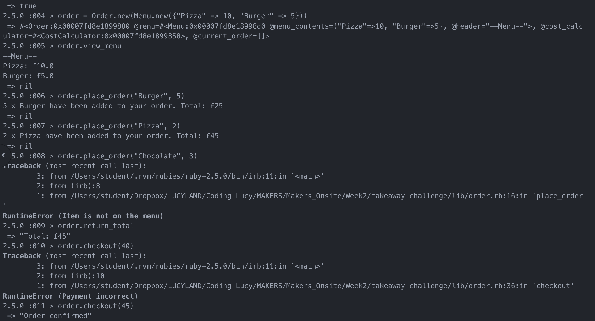

# Takeaway Challenge

## Comments:
- I didn't get on to doing the Twilio part of this challenge because I wanted to focus more closely on writing good code
- Things I tried to implement:
  - mocking(doubles and stubs) with a view to having each classes test work completely independently, which they do
  - 100% test coverage across all three classes
  - Single responsibility for as many of my methods as possible
  - Single responsibility for my classes

## Requirements:
- I would like to see a list of dishes with prices
- I would like to be able to select some number of several available dishes
- I would like to check that the total I have been given matches the sum of the various dishes in my order
- I would like to receive a text such as “Thank you! Your order was placed and will be delivered before 18:52” after I have ordered

## Initial thoughts:
- After reading the user stories I identified the need for three classes: Order, Menu and CostCalculator
- I decided that the Order class would be the one the user primarily interacted with

## Basic running of the program:
1. create a new instance of the Order class and pass it a menu in the form of a hash
2. view the menu by calling `order.view_menu`
3. place your order `order.place_order(dish, quantity)`
4. your order will be repeated back to you
5. Find out your final total `order.total`
5. checkout with the imagined amount owed `checkout(payment)`

## Feature test, including all possible errors:

## Reflections:
- I am aware that if the user checks the total repeatedly it keeps adding the overall cost to itself (doubling) this is because the method total works out the total afresh each time and then adds it to the total variable
  - ideally I would reset it at checkout and potentially not even store the total as an instance variable in the first place - I would just keep whatever was returned by the calculate method
- If I had more time I would like to add a test which checks that when the user adds in their own menu they can only add it in the format { String => Positive Integer }
- My commits are also a bit disorganised - this is because during the middle of my work I forgot to commit therefore there are commits which cover quite broad strokes of my process
