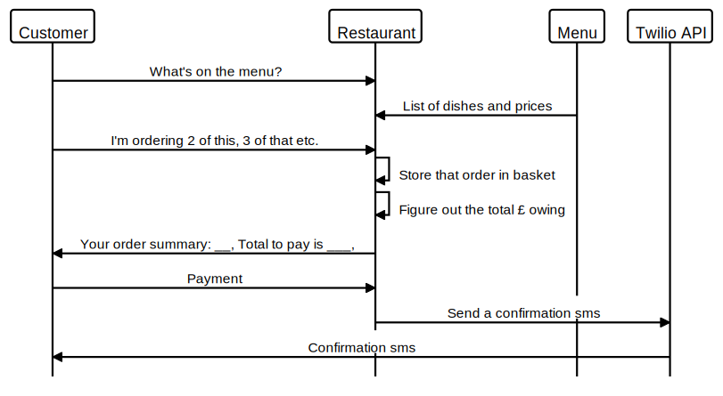
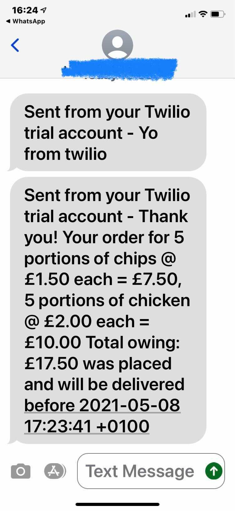

BecaLParker's solution to Takeaway Challenge
============================================

What does the code do?
-----------
Emulates a system for ordering takeaway from a restaurant.

Credits
-----------
I refered to [the code review rubric for this challenge](https://github.com/makersacademy/takeaway-challenge/blob/master/docs/review.md) during my build and testing. I also talked through stubbing and injections dependency with two other devs with reference to my code.

I refered to [Twilio's docs](https://www.twilio.com/docs/usage/api) to help construct my Twilio class code.

I refered to [@GunelMC's solution](https://github.com/GunelMC/takeaway-challenge) for an example of using dotenv to make envrionment variable persist.


Partial/Complete solution?
-------------------------
This code aims to cover all the user stories (see below) and some edgecases (e.g. customers ordering things that aren't on the menu, and preventing customers being able to chekout without passing at lesast the full total owing as an argument.)

HOWEVER, I have not yet been able to solve the stubbing for SMS and delivery time correctly. I've left some commented out code with my attempts so I can pursue this further in week 3 of Makers.


Domain model
-----------


Setup
-----
- Clone this repo to your local machine
- Run the command 'bundle' in the project directory to ensure you have all the gems
- Set Twilio environment variables. You need a [Twilio account](https://www.twilio.com/try-twilio)), then:
  - Create `.env` file in the root directory of your clone
  - Add the following in the `.env` file:
    
    - TWILIO_NUM=*your Twilio details*
    - TWILIO_TOKEN=*your Twilio details*
    - TWILIO_SID=*your Twilio details*
    - MOB_NUM=*your mobile number*
    > Make sure MOB_NUM is the verified phone number you can send TO if you have a trial Twilio account

* Now back to your terminal, require the restaurant code in irb: `irb -r './lib/restaurant.rb'`
* `2.6.5 :001 > kfc = Restaurant.new`
 `=> #<Restaurant:0x00007fe984874888>`
 
 Hooray! Now you have a restaurant instance called `kfc` in your irb to play with. See commands below to run the user stories.


User stories and example irb interactions
-----------------------------------------

```
As a customer
So that I can check if I want to order something
I would like to see a list of dishes with prices
```
Do this in irb: ` kfc.show_menu` 
You should get an output like: `=> {"chips"=>1.5, "chicken"=>2.0}`
 
```
As a customer
So that I can order the meal I want
I would like to be able to select some number of several available dishes
```
Do this in irb: `kfc.order("chips")`  to order one portion. Or `kfc.order("chips", 2)` to specify the number of portions.

You should get an output like: `=> 2 portions of chips added to your basket`

```
As a customer
So that I can verify that my order is correct
I would like to check that the total I have been given matches the sum of the various dishes in my order
```
1. First order some items (see above), then do this in irb: `kfc.basket_summary` to see subtotals of the various dishes you've ordered.
     `=> "5 portions of chips @ £1.50 each = £7.50, 5 portions of chicken @ £2.00 each = £10.00"`
2. Use that output to explain the output of `kfc.show_total`
      `=> "Total owing: £17.50"`
      
```  
As a customer
So that I am reassured that my order will be delivered on time
I would like to receive a text such as "Thank you! Your order was placed and will be delivered before 18:52" after I have ordered
```
When you're happy with your order, do this in irb: `kfc.chekout(17.50)`

You should get an output like: `=> Thanks, you'll get an SMS confirmation.` 

Unless you have my environment variables (or configure the Twilio Api with your count account details, this code will **not** send you an SMS.
However, I promise I got it working :)



