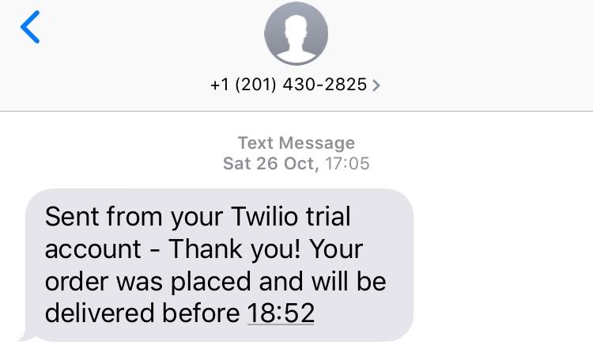

Takeaway Challenge
==================
```
                            _________
              r==           |       |
           _  //            |  M.A. |   ))))
          |_)//(''''':      |       |
            //  \_____:_____.-------D     )))))
           //   | ===  |   /        \
       .:'//.   \ \=|   \ /  .:'':./    )))))
      :' // ':   \ \ ''..'--:'-.. ':
      '. '' .'    \:.....:--'.-'' .'
       ':..:'                ':..:'

 ```
 User stories
 ------------
 ```
 As a customer
 So that I can check if I want to order something
 I would like to see a list of dishes with prices

 As a customer
 So that I can order the meal I want
 I would like to be able to select some number of several available dishes

 As a customer
 So that I can verify that my order is correct
 I would like to check that the total I have been given matches the sum of the various dishes in my order

 As a customer
 So that I am reassured that my order will be delivered on time
 I would like to receive a text such as "Thank you! Your order was placed and will be delivered before 18:52" after I have ordered
 ```

Getting started
---------------
Clone this repository
```
$ git clone https://github.com/natyeo/takeaway-challenge.git
$ cd takeaway-challenge
```

Install Bundler
```
$ gem install bundler
```

Install all this program's dependencies
```
$ bundle install
```

If you want to receive a text confirming your order [sign up for a free Twilio trial account](https://www.twilio.com/docs/usage/tutorials/how-to-use-your-free-trial-account) and set up environment variables
```
$ touch .env
```

Add your Twilio credentials and the number you want the text sent to the .env file 
```
TWILIO_ACCOUNT_SID=ACXXXXXXXXXXXX
TWILIO_AUTH_TOKEN=your_auth_token

TWILIO_NUMBER=your_twilio_number
NUMBER=number_to_receive_text
```

Usage
----------
```
$irb

2.5.0 :001 > require './lib/order.rb'
 => true

2.5.0 :002 > order = Order.new
 => #<Order:0x00007fc2f85288d0 @basket={}, @menu=#<Menu:0x00007fc2f9bf2ca0 @dishes={1=>{:dish=>"Egg fried rice", :price=>3}, 2=>{:dish=>"Sweet & sour fish", :price=>6}, 3=>{:dish=>"Morning glory", :price=>4}}>

2.5.0 :003 > order.print_menu
1. Egg fried rice: £3
2. Sweet & sour fish: £6
3. Morning glory: £4

2.5.0 :004 > order.select_dish(1, 3)
=> {:quantity=>3, :subtotal=>9}

2.5.0 :005 > order.select_dish(3, 2)
=> {:quantity=>2, :subtotal=>8}

2.5.0 :006 > order.basket_summary
3x Egg fried rice, £9
2x Morning glory, £8
=> {"Egg fried rice"=>{:quantity=>3, :subtotal=>9}, "Morning glory"=>{:quantity=>2, :subtotal=>8}}

2.5.0 :007 > order.total_bill
=>17

2.5.0 :008 > order.checkout(17)
 => <Twilio.Api.V2010.MessageInstance account_sid: ******* api_version: 2010-04-01 body: Sent from your Twilio trial account - Thank you! Your order was placed and will be delivered before 11:39 date_created: 2019-10-27 10:40:00 +0000 date_updated: 2019-10-27 10:40:00 +0000

```


My approach
-----------
* The **Menu** class contains dishes and their prices and the functionality to view these in a list format. 
* The **Order** class allows the user to select a desired quantity of dishes by their number on the menu and add these to a basket. They can use a different menu on initialization if they so wish. The user can also view a summary of their order basket, see the total price and checkout their basket. If the amount provided is correct, a text is sent to the user confirming that their order has been successfully placed.
* The **TextProvider** class implements functionality to send a text to the user using the Twilio API. Credentials and phone numbers are stored in environment variables for security.


