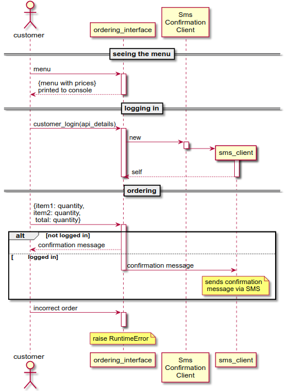

# Takeaway Challenge - Solution

## About

This is my solution to the second weekend challenge. The aim of this exercise was to practice OOP and TDD by building an application with SMS functionality from the ground up. The program lets you place an order at `Rahul's Ridiculously Rancid Restaurant` via the command line and get an order confirmation by SMS.

**Note**: There are no tests for `SmsConfirmationClient` because I don't want to provide my twilio account-sid and auth-token on github for privacy reasons. The SMS sending functionality has been mocked inside the `OrderingInterface` class. The SMS functionality has also been tested in a manual test in the [application demonstration section](#application_demonstration).

A sequence diagram is provided in its [own section](#diagram).

## Application Demonstration

```
$ irb --simple-prompt
>> # setup
=> nil
>> require "./lib/ordering_interface.rb"
=> true
>> # creating a new ordering interface
=> nil
>> interface = OrderingInterface.new
=> #<OrderingInterface:0x0000000003148590 @sms_util=SmsConfirmationClient, @login_status=false>
>> # seeing the menu
=> nil
>> interface.menu
gelatinous_grime_goulash: £7
crispy_cockroach_croquettes: £8
reeking_rat_ravioli: £11
slug_slime_secretion_soup: £9
=> {:gelatinous_grime_goulash=>7 :crispy_cockroach_croquettes=>8, :reeking_rat_ravioli=>11, :slug_slime_secretion_soup=>9}
>> # placing an order
=> nil
interface.order(
?> gelatinous_grime_goulash: 2,
?> reeking_rat_ravioli: 1,
?> total: 3)
=> "Thank you! Your order was placed and will be delivered before 13:55."
>> # ordering a dish that doesn't exist
=> nil
>> interface.order(
?> asdf: 2,
?> total: 2)
Traceback (most recent call last):
        6: from /home/rxr/.rvm/rubies/ruby-2.5.1/bin/irb:11:in `<main>'
        5: from (irb):9
        4: from /home/rxr/Imagemounts/senfiles_img/current_work/_on_github/takeaway-challenge/lib/ordering_interface.rb:17:in `order'
        3: from /home/rxr/Imagemounts/senfiles_img/current_work/_on_github/takeaway-challenge/lib/ordering_interface.rb:50:in `check_that_each_menu_item_really_exists'
        2: from /home/rxr/Imagemounts/senfiles_img/current_work/_on_github/takeaway-challenge/lib/ordering_interface.rb:50:in `each'
        1: from /home/rxr/Imagemounts/senfiles_img/current_work/_on_github/takeaway-challenge/lib/ordering_interface.rb:51:in `block in check_that_each_menu_item_really_exists'
RuntimeError (Unknown dish!)
>> # placing an order without a total
=> nil
>> interface.order(
?> gelatinous_grime_goulash: 1)
Traceback (most recent call last):
        4: from /home/rxr/.rvm/rubies/ruby-2.5.1/bin/irb:11:in `<main>'
        3: from (irb):12
        2: from /home/rxr/Imagemounts/senfiles_img/current_work/_on_github/takeaway-challenge/lib/ordering_interface.rb:15:in `order'
        1: from /home/rxr/Imagemounts/senfiles_img/current_work/_on_github/takeaway-challenge/lib/ordering_interface.rb:45:in `check_if_total_is_given'
RuntimeError (No total given!)
>> # placing an order with an incorrect total
=> nil
>> interface.order(
?> gelatinous_grime_goulash: 2,
?> total: 3)
Traceback (most recent call last):
        4: from /home/rxr/.rvm/rubies/ruby-2.5.1/bin/irb:11:in `<main>'
        3: from (irb):14
        2: from /home/rxr/Imagemounts/senfiles_img/current_work/_on_github/takeaway-challenge/lib/ordering_interface.rb:16:in `order'
        1: from /home/rxr/Imagemounts/senfiles_img/current_work/_on_github/takeaway-challenge/lib/ordering_interface.rb:61:in `check_whether_claimed_total_is_correct'
RuntimeError (Total doesn't match!)
>> # logging in (redacted only in this README)
=> nil
>> interface.customer_login(
?> account_sid: "####",
?> auth_token: "####",
?> sender_num: "####",
?> recipient_num: "####")
=> true
>> # placing an order after logging in
=> nil
>> interface.order(
?> gelatinous_grime_goulash: 1,
?> reeking_rat_ravioli: 3,
?> total: 4)
=> <Twilio.Api.V2010.MessageInstance account_sid: #### api_version: 2010-04-01 body: Sent from your Twilio trial account - Thank you! Your order was placed and will be delievered before 14:07. date_created: 2018-05-27 13:07:27 +0000 date_updated: 2018-05-27 13:07:27 +0000 date_sent:  direction: outbound-api error_code: 0 error_message:  from: #### messaging_service_sid:  num_media: 0 num_segments: 1 price: 0.0 price_unit: USD sid: #### status: queued subresource_uris: {"media"=>"/2010-04-01/Accounts/####/Messages/####/Media.json"} to: #### uri: /2010-04-01/Accounts/####/Messages/####.json>
>> # the message was indeed sent to my phone!
=> nil
```

## Diagram

I have drawn the diagram using plantUML. The source code of this diagram is available in the same directory as this readme.

