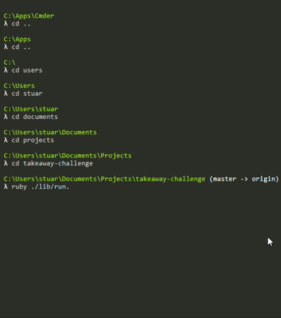
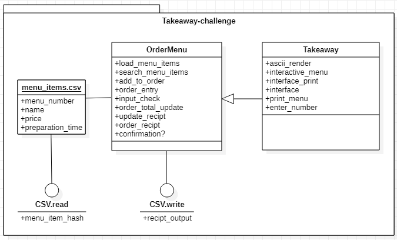

# Takeaway! 

## Instructions

1. clone to your system

2. run `bundle install` 

3. you'll need to `touch .env` and set some variables following the `.env.template` to use the Twilio functionality.

4. run `ruby ./lib/run.rb`

## Function

* So upon start the user is met with a banner with ascii text and a mennu from which to choose. 
* Upon entering `1` the menu is printed and allows the user to see what is availiable and we're looped back around to the menu for the next input. 
* `2` chooses to enter some order choices. These can be either as the `name` of the dish or the menu `number`, either will produce the right result within the order list. 
* When the user has concluded selection, we're returned to the menu where the user can either go back and add more, view their chosen dishes as a printed table or continue to order. 
* When choosing `4` the user is prompted to enter a phone number and the entry is propted back to the user to confirm, this also changes the number in to the international format so it can be set to the Twilio API to send the message. 

## Planning 
------
I made an effort to try and plan what I wanted to achieve with this challenge, using [star uml](https://staruml.io/) which is pretty cool and I recommend it as a decent free option for UML modeling.

## Gems Used

### Terminal-table

* An ascii or unicode table generator for ruby, details [here](https://github.com/tj/terminal-table).

### Twilio-ruby

* A messaging and call service gem for ruby, details [here](https://github.com/twilio/twilio-ruby).
 
### Dotenv

* Supports storing enviroment variables as a file, details [here](https://github.com/bkeepers/dotenv).

### Webmock

* A library with support for RSpec to mock and stub HTTP clients, details [here](https://github.com/bblimke/webmock).

### VCR

* Allows the recording of a tests HTTP interactions and then playing them back to create fast accurate tests, details [here](https://github.com/vcr/vcr).

* Whilst trying to get somewhere with VCR I used this comprehensive guide from [rubyguides.com](https://www.rubyguides.com/2018/12/ruby-vcr-gem/).
