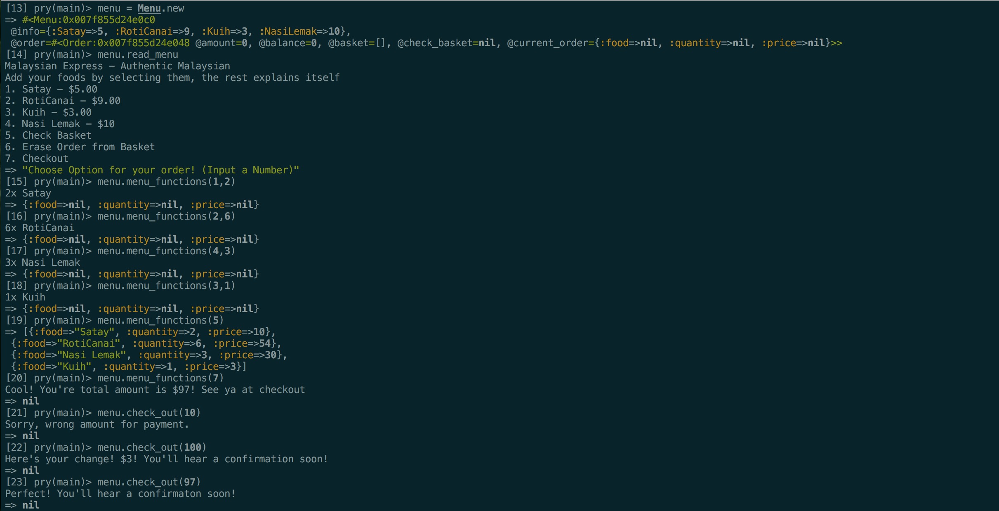

# Weekend Challenge 2#: Take away challenge

```
                            _________
              r==           |       |
           _  //            |  M.A. |   ))))
          |_)//(''''':      |       |
            //  \_____:_____.-------D     )))))
           //   | ===  |   /        \
       .:'//.   \ \=|   \ /  .:'':./    )))))
      :' // ':   \ \ ''..'--:'-.. ':
      '. '' .'    \:.....:--'.-'' .'
       ':..:'                ':..:'

 ```

## takeaway-challenge
Use the Twilio Gem to order food
(This is for the core and travis c plugin later on)

## Approach


## Domain Model

| Objects            | Messages      | Output            |
| ------------------ |:-------------:| -----------------:|
| list(dishes,prices)| see           | See A menu?       |
| dishes             | select        | Select dishes     |
| total, sum         | compare/check | Match 2 prices    |
| receive text       | receive       | Text confirmation |


## Supported Documents
- https://github.com/adam-p/markdown-here/wiki/Markdown-Cheatsheet (Markdown for Domain Model)
- https://ruby-doc.org/core-2.4.2/Hash.html (To understand hashes)
- https://stackoverflow.com/questions/18984390/accessing-array-of-hashes (Understand the array of hashes)
- https://relishapp.com/rspec/rspec-expectations/v/3-7/docs/built-in-matchers/include-matcher
- https://www.twilio.com/ (As A Trial)
