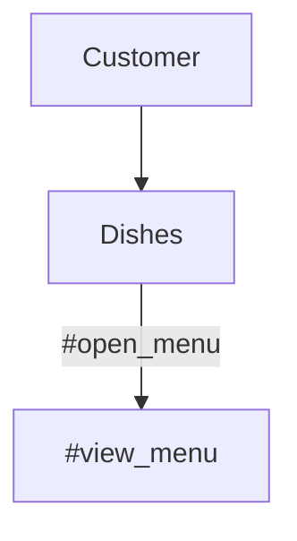
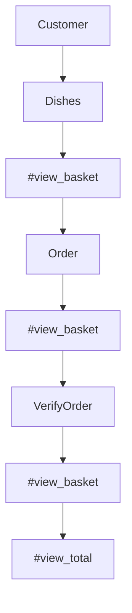
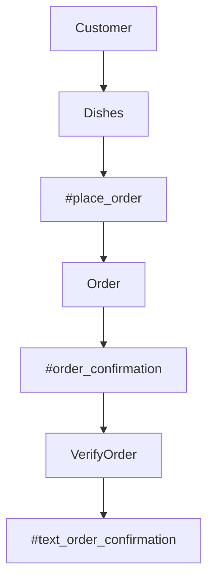

Takeaway Challenge
==================
```
                            _________
              r==           |       |
           _  //            |  M.A. |   ))))
          |_)//(''''':      |       |
            //  \_____:_____.-------D     )))))
           //   | ===  |   /        \
       .:'//.   \ \=|   \ /  .:'':./    )))))
      :' // ':   \ \ ''..'--:'-.. ':
      '. '' .'    \:.....:--'.-'' .'
       ':..:'                ':..:'

 ```

## Task

In this task, I created a Takeaway program that allows the user to view a menu, add items to the basket, view the basket and send a text to confirm the order will arrive in 1 hour. To make the program versatile with any takeaway, it accesses a CSV file to collect menu information (e.g. food type, dish, price).

I approached this challenge by using a test driven approach:

Create a domain model and diagram from the user story
Feature test the the user story via irb
Create a failing test (red) in rspec
Develop code to result in a passing test (green) in rspec
Refactor the code and re-test in rspec (orange)
Feature test the code in irb

## Getting started

1) git clone path-to-repo
2) Install bundler via `gem install bundle` (if you don't have bundler already)
3) Install dependencies via `bundle`

## Test Code

Run rspec from the main directory to test the code and check coverage

## Run

Run code using irb

`require './lib/dishes'

## Commands

`order = Dishes.new` - Creates object to allow use of commands

`order.view_menu` - View the restaurant's menu

`order.choose_dish(num)` - Add a dish to the basket

`order.view_basket` - View the basket, including items, price, total number of items and total price

`order.place_order` - Sends a text to confirm the order


## User Stories, Domain Models and Mermaid Diagrams

`As a customer
So that I can check if I want to order something
I would like to see a list of dishes with prices`

|  Objects        |  Messages      |
| ----------      | -------------  | 
| Customer        |                |
| Dishes          | open_menu, view_menu |



`As a customer
So that I can order the meal I want
I would like to be able to select some number of several available dishes`

|  Objects        |  Messages      |
| ----------      | -------------  | 
| Customer        |                |
| Dishes          | choose_dish(num)    |
| Order           | add_to_basket |

```mermaid
graph TD
    A[Customer] -->B[Dishes]
    B[Dishes] --> C[#choose_dish(num)]
    C[#choose_dish(num)] --> D[Order]
    D[Order] --> E[#add_to_basket]
```

`As a customer
So that I can verify that my order is correct
I would like to check that the total I have been given matches the sum of the various dishes in my order`

|  Objects        |  Messages      |
| ----------      | -------------  | 
| Customer        |                |
| Dishes          | view_basket |
| Order           | view_basket |
| VerifyOrder    | view_basket, view_total   |



`As a customer
So that I am reassured that my order will be delivered on time
I would like to receive a text such as "Thank you! Your order was placed and will be delivered before 18:52" after I have ordered`

|  Objects        |  Messages      |
| ----------      | -------------  | 
| Customer        |                |
| Dishes          | place_order |
| Order           | order_confirmation |
| VerifyOrder     | text_order_confirmation |


