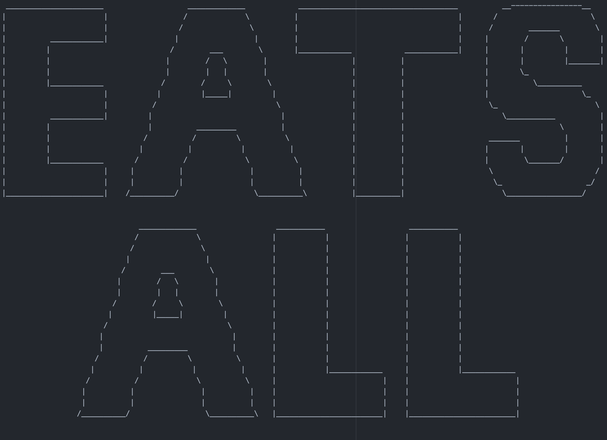

# Title
- brief Description of what the project is.
- Screenshots

# Getting Started
- git clone
- bunde install, etc.

# Usage
- COmmand to start

# Running Tests
- Rspec, etc.


# EATS ALL | Takeaway



EATS ALL Takeaway, there at your doorstep.
With our new system in place, you can easily order a takeaway AND receive text confirmation of your order and ETA!

## Getting Started

Fork and Clone the repository, and run bundle to install all necessary Gems.
```shell
$ git clone *URL
```
then:
```shell
$ bundle install
```

## Usage

To run, simply type the below code into the terminal.
```shell
ruby ./orders.rb
```
and away you go with orders!

## Running Tests

Currently, the tests give you a good idea of the end result of the program, as there isn't a comfortable and easy User Interface just yet.
