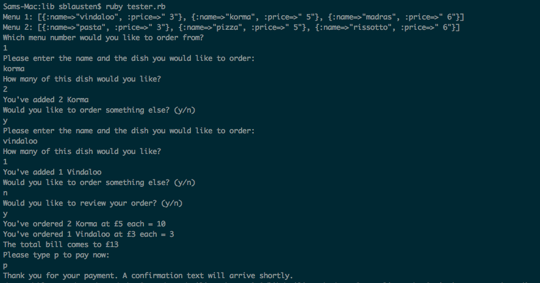

## Takeaway Challenge

This program allows the user to order from their chosen menu, and get confirmation of their order via text.

It uses the Twilio API to send a confirmation text.



### User Stories taken in:
```
As a customer
So that I can check if I want to order something
I would like to see a list of dishes with prices

As a customer
So that I can order the meal I want
I would like to be able to select some number of several available dishes

As a customer
So that I can verify that my order is correct
I would like to check that the total I have been given matches the sum of the various dishes in my order

As a customer
So that I am reassured that my order will be delivered on time
I would like to receive a text such as "Thank you! Your order was placed and will be delivered before 18:52" after I have ordered
```

## To run locally:

```bash
git clone https://github.com/sblausten/takeaway-challenge.git
cd takeaway-challenge
bundle install
ruby run.rb
```

## To run test suite

```bash
cd takeaway-challenge
bundle install
rspec
```

## My 'Takeaways'
- Testing interaction with an external API using network stubbing

## Outstanding issues
- Some UI logic is still mixed in business logic
- Need to increase test coverage for view class
- Need to make sure dependancy injection is used throughout - (Currently SmsConfirmation is initialised from CustomerView)
