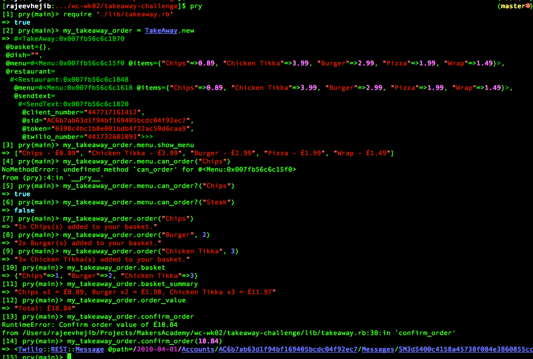

Takeaway Challenge
==================


Specifications
--------------

Develop and implement a restaurant food takeaway application.  The program should facilitate functioning of a ordering a dish from a restaurant for a takeaway.  Implement the functionality based on following guidelines:

* Restaurant provides list of dishes with prices.

* Customer places an order with
  * list of dishes,
  * their quantities and
  * specifies total number of items ordered.

  The sum of quantities ordered should be equal to this total number. The system should raise an error if these numbers do not matches

* Restaurant sends text message to customer when an order is placed successfully that it will be delivered within the next hour.

* Use twilio-ruby gem to access the API which implements text sending functionality.

* Use mocks and/or stubs, as necessary to not to send texts when the tests are run

* Advanced functionality
  * Implement the ability to place orders via text message.


User Story
----------˜

```
As a customer
So that I can check if I want to order something
I would like to see a list of dishes with prices

As a customer
So that I can order the meal I want
I would like to be able to select some number of several available dishes

As a customer
So that I can verify that my order is correct
I would like to check that the total I have been given matches the sum of the various dishes in my order

As a customer
So that I am reassured that my order will be delivered on time
I would like to receive a text such as "Thank you! Your order was placed and will be delivered before 18:52" after I have ordered
```

My approach
-----------
* Created three classes
  * Takeaway class (takeaway.rb)
    * deals with takeaway orders
    * shows whats in basket (order)
    * shows basket summary with total value of all items on order
    * asks user to confirm order by giving the total order value
  * Restaurant class (restaurant.rb)
    * deals with receiving the order and sending out confirmation texts
    * sending out text is dealt by sendtext.rb
  * Menu class
    * deals with menu items that are on order
    * shows menu
    * allows user to check if a dish can be ordered

A test run is as below
----------------------




[](https://travis-ci.org/makersacademy/takeaway-challenge)
[](https://coveralls.io/r/makersacademy/takeaway-challenge)
