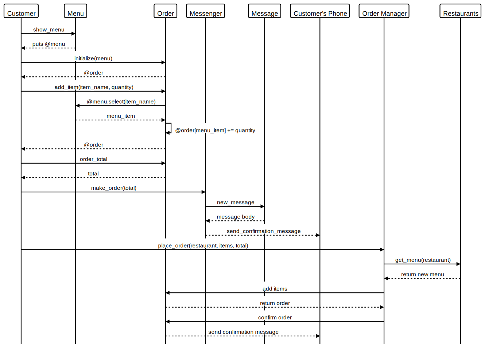

Takeaway Challenge
==================
```
                            _________
              r==           |       |
           _  //            |  M.A. |   ))))
          |_)//(''''':      |       |
            //  \_____:_____.-------D     )))))
           //   | ===  |   /        \
       .:'//.   \ \=|   \ /  .:'':./    )))))
      :' // ':   \ \ ''..'--:'-.. ':
      '. '' .'    \:.....:--'.-'' .'
       ':..:'                ':..:'

 ```

### Usage

I attempted to design the Takeaway system so that user interaction is as simple as possible. When ordering from a restaurant all the user needs to do is create a new `OrderManager` object and use the `#new_order` function with the name of the restaurant the user wants to order from a list of dish and quantity pairs and final order total. If the actual total and user's estimated total match and order will be placed. A confirmation text message will be sent to the user informing that their order was placed and that they will receive there food in one hour.

The simplicity of interaction was also essential to allow the system to expand to accept orders by text message easily. Now a SMS messages with TWILIO via sinatra can simply accept the messsage body directly as a argument list to the `new_order` inputs on the `OrderManager` class with minimal formatting.

### IRB

Example usage in the `irb`.
```
order = OrderManager.new
2.6.5 :004 > order.new_order('Italian', 'Pizza', 1, 'Lasagne', 2, 26)
```

### Development

Below is a sequence diagram of the how the Takeaway system works. Menu items and menus are extracted out into separated classes tracking price and name. Further I used a `JSON` file as a temporary database with a list of restaurants and their menus that is populated by the `Restaurants` class when managing an order.



### Future Development

While the main building blocks have been set up to allow for easy order submission the incoming SMS functionality still needs to be implemented.
