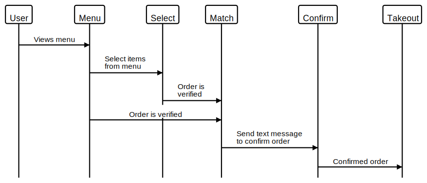

Takeaway Challenge by Sophie Brown
==================
```
                                 _________
                   r==           |       |
                _  //            |  S.B. |   ))))
               |_)//(''''':      |       |
                 //  \_____:_____.-------D     )))))
                //   | ===  |   /        \
            .:'//.   \ \=|   \ /  .:'':./    )))))
           :' // ':   \ \ ''..'--:'-.. ':
           '. '' .'    \:.....:--'.-'' .'
            ':..:'                ':..:'

 ```

Task
-----
* The task was to write a Takeaway program with the following user stories:

```
As a customer
So that I can check if I want to order something
I would like to see a list of dishes with prices

As a customer
So that I can order the meal I want
I would like to be able to select some number of several available dishes

As a customer
So that I can verify that my order is correct
I would like to check that the total I have been given matches the sum of the various dishes in my order

As a customer
So that I am reassured that my order will be delivered on time
I would like to receive a text such as "Thank you! Your order was placed and will be delivered before 18:52" after I have ordered
```

> :warning: **WARNING:** think twice before you push your **mobile number** or **Twilio API Key** to a public space like GitHub :eyes:
>
> :key: Now is a great time to think about security and how you can keep your private information secret. You might want to explore environment variables.


**Skills used:**
-----
  - Domain modelling
  - Updating Gemfiles
  - Class extraction
  - Dependency injection

-----
The flow chart appended displays the flow of the user stories and the direction of the functions. :arrow_right:



-----
The below domain model was created using Mermaid :mermaid: and demonstrates the distribution of responsibilities between the classes :notebook:.
It also illustrates the class dependencies.

                   

