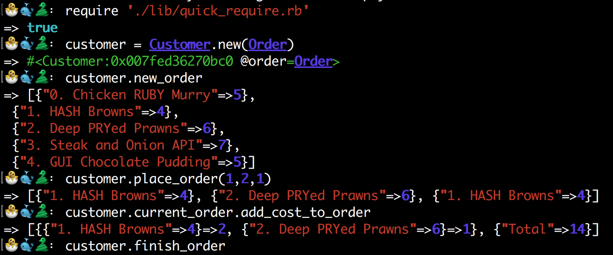

## Takeaway Challenge ##

The goal of the challenge was to write a takeaway program which would have functionality specified in user stories. This functionality included being able to see a list of dishes with prices, place an order, check the total cost of the dishes and receive a text confirming your order.

#### My Approach ####

This was the first time I had attempted designing a program from a message based perspective as opposed to an object based one. After some time spent diagramming I decided that would be 5 classes required for this project, a Customer, a Menu, an Order, an Order Total and a Message class.

#### How it works ####
Open a REPL and follow these commands to see basic functionality. There is a file called quick_require.rb located in the lib directory which will require all of the other files for time saving purposes.



==================
```
                            _________
              r==           |       |
           _  //            |  M.A. |   ))))
          |_)//(''''':      |       |
            //  \_____:_____.-------D     )))))
           //   | ===  |   /        \
       .:'//.   \ \=|   \ /  .:'':./    )))))
      :' // ':   \ \ ''..'--:'-.. ':
      '. '' .'    \:.....:--'.-'' .'
       ':..:'                ':..:'

 ```
