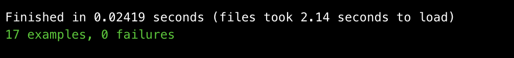

# Takeaway Challenge

Takeaway challenge is a command line app that allows a user to order take away from a restaurant. You can have a look at the menu, chose the items that they want, and see the total that they will have to pay for the order.

Once the order is confirmed, the user will get a text to confirm, including the expected delivery time.

### How to Use:
As this is a command line app, clone the repo, then open and require the `./lib/order.rb` and `./lib/menu.rb` files.

1. Create new menu object, this will need an array of hashes that contain the name of the item and the price, allowing the user to set their own menu. For example a pizza restaurant:

`2.5.0 :004 > menu =  Menu.new([{ "Margherita" => 8 }, { "Roasted Vegetable" => 9 }, { "Chorizo" => 12 }])`

2. Create a new order object. This needs access to the menu items.

`2.5.0 :005 > order = Order.new(menu.items)`

3. View the items and their prices on the menu using `menu.items`

4. You can then select the a type of pizza that you want, and a quantity.

`2.5.0 :008 > order.choose("Chorizo", 1)`

`2.5.0 :009 > order.choose("Roasted Vegetable", 1)`

5. Confirm your order using `confirm_order` method. This will trigger a confirmation message with the total due and what has been ordered.

`2.5.0 :010 > order.confirm_order`

### File Manifest:
The main files that you will need the items in the 'lib' folder. This includes:
* `menu.rb`
* `order.rb`
* `send_sms.rb`

### Dependancies:
This program is written in Ruby, using Sinatra as the frame work. To run this program the gems required are Twilio-Ruby to send text messages and Dotenv to handle environment variables.

Rubocop has been used for linting and simplecov for test coverage.

### My approach to this Challenge:
I used TDD and OOD to design and create this program. I aimed to create as little dependancy as possible using polymorphism and doubles. I used the Single Responsibility Principle to extract order and `menu` classes as well as a `send_sms` module. These follow the law of Demeter.

I chose to not add the functionality where a user enters what they would expect the total to be as I initially found this to be a strange and perhaps un-user friendly feature. I have decided to seek further information before implementation.

## Testing:
I test drove this app using rspec.

To run the test, please use the command `rspec`. Note that this will run both unit tests (`./menu_spec.rb`, `./order_spec.rb`, and `./send_sms_sepc.rb`) and also feature tests (`./feature_tests/user_stories_spec_rb`).

All tests are passing.

## Known Issues:
The test coverage is 95.31% due to use of Twilio. I have ensured that the `send_message` method is called correctly in a feature tests, but I would attempt to stub the method.
