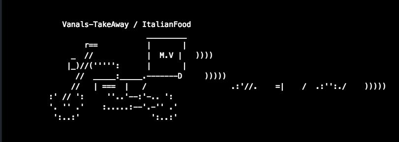
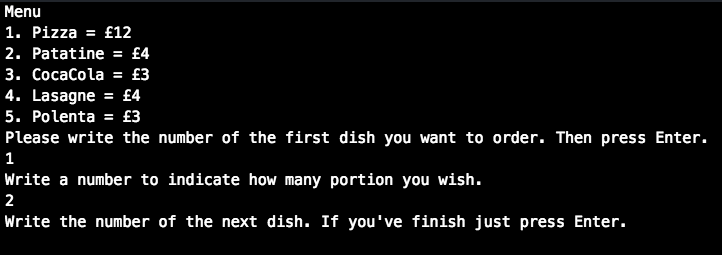
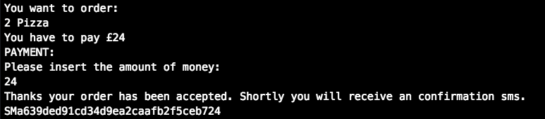

Takeaway Challenge
==================
```
                            _________
              r==           |       |
           _  //            |  M.A. |   ))))
          |_)//(''''':      |       |
            //  \_____:_____.-------D     )))))
           //   | ===  |   /        \
       .:'//.   \ \=|   \ /  .:'':./    )))))
      :' // ':   \ \ ''..'--:'-.. ':
      '. '' .'    \:.....:--'.-'' .'
       ':..:'                ':..:'

 ```

# Instruction

-Go in ./lib/twiliosms.rb and add in the 12 line your number.
-At the beginning of 'restaurant.rb' and 'takeaway_interface.rb'  change the path of the required files with yours.
Then with your terminal go in the main folder, and run './lib/interface.rb'






# Approach

-Read carefully the EX_README.md file <br >
-Made domains models for each user story <br>
-Read the 'Hints on functionality to implement' section in the EX_README.md file. <br>
-Followed TDD <br>
-Google a lot when struggling. <br>


I've mainly followed the user tasks. They were quite clear. Initially i wasn't sure if use an Hash or an Array to contain the list of foods and prices. Then I decided to use an array because more compatible with the idea to let choose
the food in base of their number.
The second issues that I had was test a method where there was a while loop based on an user input (gets.chomp). So I made some research and I understood how to stub it.
The third main difficulty was test twilio without receiving any sms.
I googled  but all the solution looked quite complicated, then i read the review file and followed the instruction.
Another issue that I had is about the 'require' method. For some reasons is necessary that i put the whole path of a file, otherwise I get an error.
