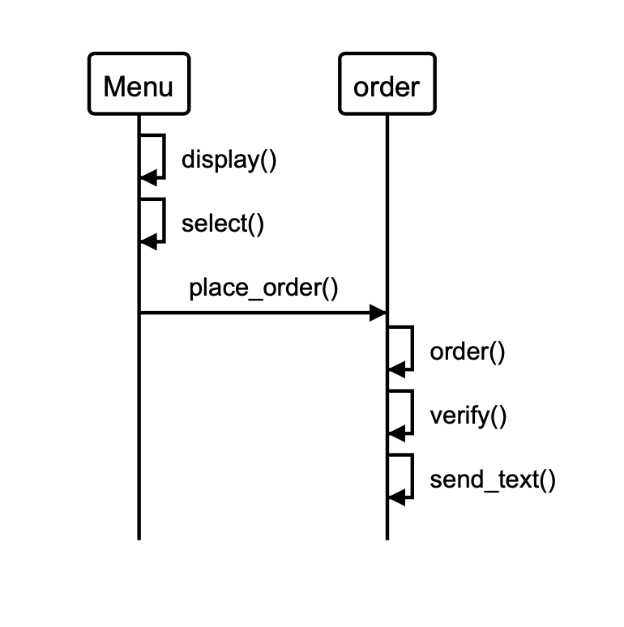

Week two - Takeaway challenge - Hibo Abdilaahi
==================
```
                            _________
              r==           |       |
           _  //            |  M.A. |   ))))
          |_)//(''''':      |       |
            //  \_____:_____.-------D     )))))
           //   | ===  |   /        \
       .:'//.   \ \=|   \ /  .:'':./    )))))
      :' // ':   \ \ ''..'--:'-.. ':
      '. '' .'    \:.....:--'.-'' .'
       ':..:'                ':..:'

 ```

About this project
-------
This program enables a user to place orders from a set menu.

The process of the program is displayed in the following model. A description of the methods can be found below.



It includes the following features:

  * display() - enables a user to view a menu
  * select() - enables a user to place specified menu items into a basket. The method takes a unlimited number of arguments in the form of a hash with the dish name and quantity specified. See an example of this in the screenshot below.
  * place_order() - enables a user to place an order.
      * This method takes one parameter, the expected order total. This is then verified (the expected order total referenced against the actual order total) and if this equals the actual order total, the order is placed.
      * If the order total does not equal the actual order total, an error is raised.
      * When the order is placed, the user will receive an SMS text message letting them know that their order has been placed and will be with them in one hour.

An example of the user journey is below:

[insert screenshot of irb output]


How to run this on your computer
-----

To run this on your computer, complete the following steps:

1. Fork this repository and clone to your local computer.
2. Run the command 'bundle' in the project directory to ensure you have all the gems.
3. You will require the terminal to run the program. Open your preferred terminal.
4. Navigate to the 'takeaway-challenge' folder where you have cloned this repository and your files remain.
5. Type 'irb' which will open the interactive ruby environment.
6. You are now able to type in prompts the terminal to run the program. Use the 'takeaway.irb' file to help.

You will require the following gems:

* rspec
* rubocop
* simplecov-console, require: false, group: :test
* simplecov, require: false, group: :test
* sinatra
* twilio-ruby

To run tests, complete the following steps

1. Open your terminal and make sure you are in the correct file path ending with the directory 'takeaway-challenge'.
2. Type the command ‘rspec’ in the terminal to run all tests.

Important note
-----

**In order to use the send SMS functionality the twilio account information and mobile information needs to be changed**

The following links will enable you to set up a TWILIO account (its free) which will then enable you to change the information.

How to contribute
-----

If you would like to contribute to this project, you can follow the instructions below

1. Clone this repository to your local computer
2. Create a new branch: $ git checkout https://github.com/hiboabd/takeaway_challenge -b name_for_new_branch.
3. Make changes and test
4. Submit Pull Request with comprehensive description of changes
