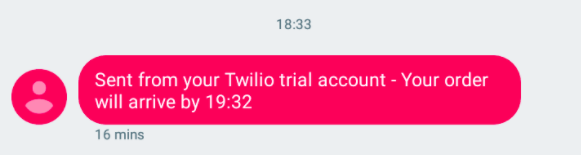
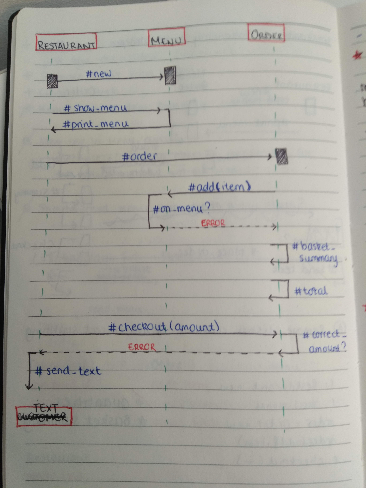

Takeaway Challenge
==================

About
-----
This is the Week 2 Makers Academy Challenge, built in one weekend, using Ruby. The task was to create a program which the user interacts with in irb, and which satisfies the following user stories

```
As a customer
So that I can check if I want to order something
I would like to see a list of dishes with prices
```
```
As a customer
So that I can order the meal I want
I would like to be able to select some number of several available dishes
```
```
As a customer
So that I can verify that my order is correct
I would like to check that the total I have been given matches the sum of the various dishes in my order
```
```
As a customer
So that I am reassured that my order will be delivered on time
I would like to receive a text such as "Thank you! Your order was placed and will be delivered before 18:52" after I have ordered
```

How to use
-----
1. Clone this repo
2. Run `$ bundle install` to install required gems
3. Create a file called `hidden_data.env` in the root directory, assigning your details to the following variables (you will need to create a free Twilio account to get these)
    - "MY_PHONE_NUMBER"
    - "TWILIO_PHONE_NUMBER"
    - "TWILIO_ACCOUNT_SID"
    - "TWILIO_AUTH_CODE"
4. Run `$ irb` and `require './lib/restaurant.rb'`

Approach
-----
- I began by creating a diagram of the classes I would ned, and how they should interact with one another (see below)
- I worked through the above user stories, one at a time, using TDD to drive my code
- I made sure to use doubles and stubs where appropriate to create isolated unit tests
- I aimed to achieve full test coverage
- To send the confirmation texts, I integrated the Twilio API into my program using the twilio-ruby gem
- To avoid disclosing my personal information, I created a file with environmental variables which I added to .gitignore
- I required the dotenv gem to access these variables
- After satisfying the above user stories, I refactored my code, ensuring necessary methods were made private, and trying to abide by the Single Responsibility Principle for methods

Example irb Output
-----
```
$ irb
2.5.0 :001 > require './lib/restaurant.rb'
 => true
2.5.0 :002 > restaurant = Restaurant.new
 => #<Restaurant:0x00007fb8109af6a8 @menu=#<Menu:0x00007fb8109af680 @dishes={"Prawn Toast"=>2.5, "Spring Rolls"=>2.0, "Chicken Chow Mein"=>5.5, "Sweet and Sour Pork"=>6.0, "Vegetable Curry"=>5.0, "Fried Rice"=>3.5}>>
2.5.0 :003 > restaurant.show_menu
Menu
----------
Prawn Toast: £2.50
Spring Rolls: £2.00
Chicken Chow Mein: £5.50
Sweet and Sour Pork: £6.00
Vegetable Curry: £5.00
Fried Rice: £3.50
 => {"Prawn Toast"=>2.5, "Spring Rolls"=>2.0, "Chicken Chow Mein"=>5.5, "Sweet and Sour Pork"=>6.0, "Vegetable Curry"=>5.0, "Fried Rice"=>3.5}
2.5.0 :004 > order = restaurant.create_order
 => #<Order:0x00007fb8113ceeb8 @basket={}, @menu=#<Menu:0x00007fb8113cee90 @dishes={"Prawn Toast"=>2.5, "Spring Rolls"=>2.0, "Chicken Chow Mein"=>5.5, "Sweet and Sour Pork"=>6.0, "Vegetable Curry"=>5.0, "Fried Rice"=>3.5}>, @total=0>
2.5.0 :005 > order.add("Prawn Toast")
 => "1x Prawn Toast has been added to your order"
2.5.0 :006 > order.add("Chicken Chow Mein",2)
 => "2x Chicken Chow Mein has been added to your order"
2.5.0 :007 > order.summary
Order Summary
----------
Prawn Toast x1 £2.50
Chicken Chow Mein x2 £11.00
----------
Order total is £13.50
 => nil
2.5.0 :008 > order.add("Fried Rice")
 => "1x Fried Rice has been added to your order"
2.5.0 :009 > order.add("Prawn Toast")
 => "1x Prawn Toast has been added to your order"
2.5.0 :010 > order.summary
Order Summary
----------
Prawn Toast x2 £5.00
Chicken Chow Mein x2 £11.00
Fried Rice x1 £3.50
----------
Order total is £19.50
 => nil
2.5.0 :011 > restaurant.checkout(19.50)
```


Domain Model Diagram
----


Author
-----
Hannah Lillis
