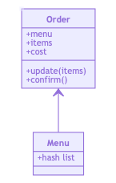

Takeaway Challenge
==================
This program is designed to emulate a Takeaway ordering service.

```
                            _________
              r==           |       |
           _  //            |  M.A. |   ))))
          |_)//(''''':      |       |
            //  \_____:_____.-------D     )))))
           //   | ===  |   /        \
       .:'//.   \ \=|   \ /  .:'':./    )))))
      :' // ':   \ \ ''..'--:'-.. ':
      '. '' .'    \:.....:--'.-'' .'
       ':..:'                ':..:'

 ```

Learning goals
--------------
- I hope to reinforce my knowledge of RSPEC and OO design principles and application.
- Use a test driven approach to create the software.
- Integrate the software into a Twilio API.

Software Requirements
---------------------
- Code must be elegant: every class has a clear responsibility, methods are short etc. <br/> Refer to the [code review rubric](docs/review.md).
- High test coverage with all tests passing.
- Ensure you have a list of dishes with prices
- Place the order by giving the list of dishes, their quantities and a number that should be the exact total. If the sum is not correct the method should raise an error, otherwise the customer is sent a text saying that the order was placed successfully and that it will be delivered 1 hour from now, e.g. "Thank you! Your order was placed and will be delivered before 18:52".
- The text sending functionality should be implemented using Twilio API. You'll need to register for it. It’s free.
- Use the twilio-ruby gem to access the API
- Use the Gemfile to manage your gems
- Make sure that your Takeaway is thoroughly tested and that you use mocks and/or stubs, as necessary to not to send texts when your tests are run
- However, if your Takeaway is loaded into IRB and the order is placed, the text should actually be sent
- Note that you can only send texts in the same country as you have your account. I.e. if you have a UK account you can only send to UK numbers.
### Advanced  (have a go if you're feeling adventurous):
* Implement the ability to place orders via text message.

* A free account on Twilio will only allow you to send texts to "verified" numbers. Use your mobile phone number, don't worry about the customer's mobile phone.

> :warning: **WARNING:** think twice before pushing your **mobile number** or **Twilio API Key** to a public space like GitHub :eyes:
>
> :key: Think about security and how you can keep your private information secret. Explore environment variables.


## My approach

### 1. Modelling

  - I start by writing a domain model for a user story.
  - Then I draw a class diagram.
  - Do just enough design upfront to start.

### 2. TDD

  - Start with a test for the smallest meaningful feature.
  - Writea test and watch it fail before writing code.
  - Only write code to fix the test fail message I can see.
  - Include edge cases in tests.
  - Look for an opportunity to refactor the code after getting to green.
  - Refactore verbose tests after the code is working.

### Problem solving 
  - Try to understand the problem by diagramming, or writing pseudo-code.
  - Break the problem down into smaller problems.
  - Verbalise my thought process when solving a problem.

## User Story 1

```
As a customer
So that I can check if I want to order something
I would like to see a list of dishes with prices
```
From the users perspective in IRB:

```
order = Order.new
=> #<Order:0x00007f863783fda0 @menu={:fish=>5, :chips=>3, :salad=>2}> 
order.menu
=> {:fish=>"£5", :chips=>"£3", :salad=>"£2"} 
```

## User Story 2

```
As a customer
So that I can order the meal I want
I would like to be able to select some number of several available dishes
```
From the users perspective in IRB:
```
order = Order.new
=> #<Order:0x00007f863783fda0 @menu={:fish=>5, :chips=>3, :salad=>2}> 
order.update("1 fish, 3 salad, 2 chips")
=> {:fish=>1, :salad=>3, :chips=>2}
```

## User Story 3

```
As a customer
So that I can verify that my order is correct
I would like to check that the total I have been given matches the sum of the various dishes in my order
```
From the users perspective in IRB:
```
order = Order.new
=> #<Order:0x00007f863783fda0 @menu={:fish=>5, :chips=>3, :salad=>2}, @cost=0, @items=[]> 
order.update("1 fish, 3 salad")
=> {:fish=>1, :salad=>3}
order.items
=> {:fish=>1, :salad=>3} 
order.cost
=> 11
```

## User Story 4

```
As a customer
So that I am reassured that my order will be delivered on time
I would like to receive a text such as "Thank you! Your order was placed and will be delivered before 18:52" after I have ordered
```
From the users perspective in IRB:
```
order = Order.new
=> #<Order:0x00007f863783fda0 @menu={:fish=>5, :chips=>3, :salad=>2}, @cost=0, @items=[]> 
order.update("1 fish, 3 salad")
=> {:fish=>1, :salad=>3}
order.cost
=> 11
order.confirm
=> "Thank you! Your order was placed and will be delivered before 2020-03-29 18:22:59 +0100."
```

## My own Story

```
As a customer
So that I can change my order if it is wrong
I would to be able alter my order before I confirm
```
From the users perspective in IRB:
```
order = Order.new
=> #<Order:0x00007f863783fda0 @menu={:fish=>5, :chips=>3, :salad=>2}, @cost=0, @items=[]> 
order.update("1 fish, 3 salad")
=> {:fish=>1, :salad=>3}
order.cost
=> 11
order.update("2 fish, 0 salad")
=> {:fish=>2}
order.cost
=> 10
```

## Domain model

Objects | Messages
--------|--------
Menu| @list
Order | @menu <br/>  @items <br/> @cost <br/> update(items) <br/> confirm

## Class Diagram



