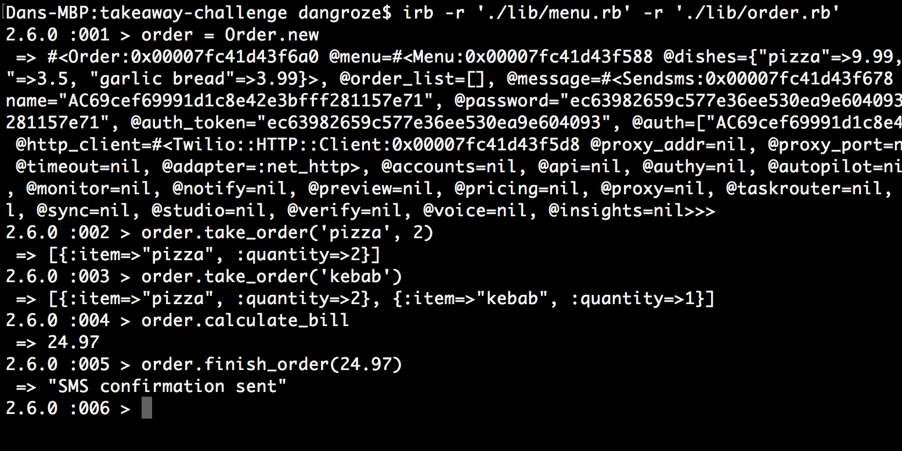

# Takeaway Challenge
==================
```
                            _________
              r==           |       |
           _  //            |  M.A. |   ))))
          |_)//(''''':      |       |
            //  \_____:_____.-------D     )))))
           //   | ===  |   /        \
       .:'//.   \ \=|   \ /  .:'':./    )))))
      :' // ':   \ \ ''..'--:'-.. ':
      '. '' .'    \:.....:--'.-'' .'
       ':..:'                ':..:'

 ```

### Weekend challenge at Makers Academy. Specs below.
### Completed using: Ruby, RSpec, rubocop linter

# User stories:
```
As a customer
So that I can check if I want to order something
I would like to see a list of dishes with prices

As a customer
So that I can order the meal I want
I would like to be able to select some number of several available dishes

As a customer
So that I can verify that my order is correct
I would like to check that the total I have been given matches the sum of the various dishes in my order

As a customer
So that I am reassured that my order will be delivered on time
I would like to receive a text such as "Thank you! Your order was placed and will be delivered before 18:52" after I have ordered
```
### Instructions:
* TakeAway app with a menu
* Show the menu
* Place orders
* Check total cost
* Send SMS confirmation with delivery time 

### How to run:

* Fork or clone this repository
```
git clone https://github.com/dangroze/takeaway-challenge.git
```
* Open terminal, go to the file location
* Run bundle install
* Type in: irb -r './lib/menu.rb' -r './lib/order.rb'
* Follow instructions in the screenshot:



* Open terminal, go to cloned folder
* Type in rspec

Note: Before running, you will need to set the variables inside the twilio.rb file: account_sid, auth_token, @TWILIO_NUMBER and @MY_NUMBER, to the respective values of your Twilio account. These can be generated by making a trial account on the Twilio Website.