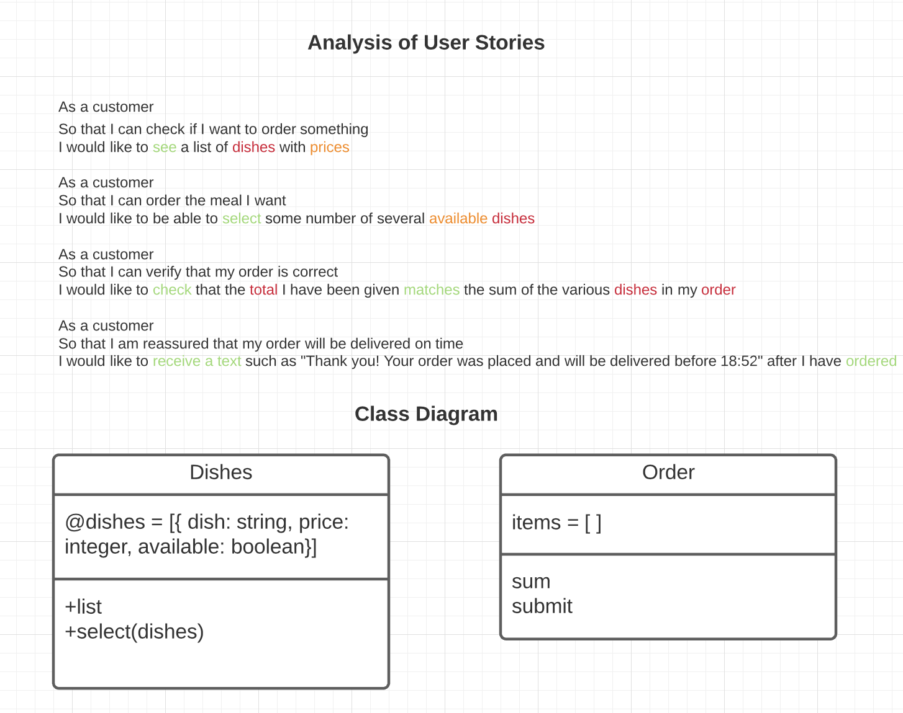

# Takeaway Challenge

Takewaway is a programme that allows customers to order dishes. I have implemented the first user story that allows customers to view a list of dishes and prices.

Please [see below](https://github.com/katemyoung/takeaway-challenge#reflections) for my reflections on how I solved this problem.

[](https://github.com/rubocop/rubocop) `Test coverage: 100%`

## How to explore this programme

Use git clone to create a local repo. 
`git clone https://github.com/katemyoung/airport_challenge.git` 

Use bundler to install the required gems by running the command `bundle` in the project directory.

Navigate to the local repo then run irb.
`irb -r './lib/dishes.rb'`

Run `rspec` from the project directory to run the tests.

**You can use this programme in irb to:**
- Create a new menu by instantiating a new instance of the Dishes class `menu = Dishes.new`, and passing it as an argument a hash of the form `{dish: 'Dish Name', price: price}` 
- View the menu by calling the list method `menu.list`
- Add to the menu using the add method `menu.add`

**Here's an example of how to run this programme in irb:**
```
➜  takeaway-challenge git:(main) irb -r ./lib/dishes.rb
3.0.2 :001 > menu = Dishes.new({ dish: 'Pizza', price: 5 })
 => #<Dishes:0x00007fab579e7348 @dishes=[{:dish=>"Pizza", :price=>5}]> 
3.0.2 :002 > menu.list
Pizza: £5
 => [{:dish=>"Pizza", :price=>5}] 
3.0.2 :003 > menu.add({ dish: 'Pasta', price: 3 })
 => [{:dish=>"Pizza", :price=>5}, {:dish=>"Pasta", :price=>3}] 
3.0.2 :004 > menu.list
Pizza: £5
Pasta: £3
 => [{:dish=>"Pizza", :price=>5}, {:dish=>"Pasta", :price=>3}] 
3.0.2 :005 > 
```

## User Stories
```
As a customer
So that I can check if I want to order something
I would like to see a list of dishes with prices

As a customer
So that I can order the meal I want
I would like to be able to select some number of several available dishes

As a customer
So that I can verify that my order is correct
I would like to check that the total I have been given matches the sum of the various dishes in my order

As a customer
So that I am reassured that my order will be delivered on time
I would like to receive a text such as "Thank you! Your order was placed and will be delivered before 18:52" after I have ordered
```

## Domain model


# Reflections

## How I planned to solve this challenge
*I drew on feedback from peer review and self-reflection on my [Airport Challenge programme](https://github.com/katemyoung/airport_challenge) to set goals for process improvement in this challenge.*
- [x] Parse user stories and extract verbs and nouns into class diagram domain model
- [x] Feature test the implementation of the first user story in irb `menu.list`
- [x] Follow a tight TDD process of **red, green, refactor** to test drive the development of the feature for the first user story.
- [x] Aim for 100% test coverage whilst refactoring previous unit tests as they became vacuous.
- [x] Use rubocop for code quality.
- [x] If I go off track, to use git to restore a previous working version. 
- [ ] Add a SimpleCov test coverage badge to this README

## What I learnt during this challenge:

**Technical**
- The RSpec `output` matcher and how to format a string with new lines using backslash instead of quotes.
- Hash `fetch` method
- Use of RSpecs `let` construct and `before` hook to minimise duplication of test setup code. 

**TDD**
- The importance of moving in baby steps and using the error messages to guide you.
- Taking the time to feature test in irb before, during and after. 

## Questions

- I'm not sure I have initialized the dishes class in the most efficient way. How to initalize a hash automatically?
- I wonder if a separate Dish class would be more SRP.
- I created an 'add' method which was not specified in the user stories, which I feel is not very TDD. Could I have mocked this instead for my test set up?

## Feedback from code review

*See also PR comments*

## Next challenge I aim to:
- [ ] Add a SimpleCov test coverage badge to the README
