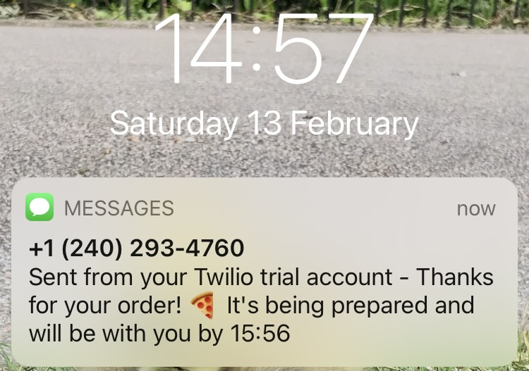

# Takeaway

[](https://codeclimate.com/github/AJ8GH/takeaway-challenge/maintainability) [](https://travis-ci.com/AJ8GH/takeaway-challenge) [](https://coveralls.io/github/AJ8GH/takeaway-challenge?branch=master)


## Dependencies

### Ruby version
- `2.6.5`

### Gems
- `coveralls`
- `rake`
- `rspec`
- `rubocop`
- `twilio-ruby`

## Getting started

### Clone

```shell
git clone git@github.com:AJ8GH/takeaway-challenge
```

### Install dependencies

```shell
bundle
```

### Register with Twilio

You'll need a Twilio account and phone number to enable the sms messaging. Don't worry, it's totally free!
- [Register your free account](https://www.twilio.com/try-twilio)
- Verify your mobile number
- Go to your [Console page](https://www.twilio.com/console)

### `cd` into root folder
```shell
cd takeaway-challenge
```

### Create .env file to store environment variables
```shell
touch .env
```

### Add your `ENV VAR`'s
Substitute the values with your account info from the console page and the  mobile number you verified

```
export MOBILE_PHONE_NUMBER=<your_mobile_phone_number>
export TWILIO_PHONE_NUMBER=<your_twilio_phone_number>
export TWILIO_AUTH_TOKEN=<your_twilio_auth_token>
export TWILIO_ACCOUNT_SID=<your_twilio_account_sid>
```

### Load takeaway script in `irb`
```shell
irb -r ./lib/takeaway.rb
```

## How to use

#### Name and create your restaurant

```ruby
dot_slice = Restaurant.new
=> #<Restaurant:0x00007f987faf8538 @customer_service=#<CustomerService:0x00007f987faf8470 @client_class=Twilio>, @display=#<Display:0x00007f987faf8448>, @menu={:marinara=>8, :margherita=>10, :bufalina=>13, :diavola=>14, :napoli=>14, :calzone=>14, :fiorentina=>14, :capricciosa=>15}, @order=[]>
```

### _Welcome to Dot Slice!_

#### Check out the menu

```ruby
dot_slice.view_menu
=> ["Marinara: £8.00", "Margherita: £10.00", "Bufalina: £13.00", "Diavola: £14.00", "Napoli: £14.00", "Calzone: £14.00", "Fiorentina: £14.00", "Capricciosa: £15.00"]
```

#### Choose your pizzas

```ruby
dot_slice.add 'bufalina'
=> "Bufalina has been added to your order 🍕"

dot_slice.add 'calzone'
=> "Calzone has been added to your order 🍕"
```

#### Check your order anytime you like

```ruby
dot_slice.view_order
=> ["Bufalina: £13.00", "Calzone: £14.00", "Total: £27.00"]
```

#### Place your order when ready

```ruby
dot_slice.place_order
```
```
Bufalina: £13.00
Calzone: £14.00
Total: £27.00
Confirm order? Hit ⏎ to confirm, c to cancel
```
Cancelling results in a `RuntimeError` to prevent the order from completing, but preserves the order basket. Confirming results in a confirmation message in irb and by text.

```
Thanks for your order! Check your phone for confirmation. Buon Appetito!

 => <Twilio.Api.V2010.MessageInstance body: Sent from your Twilio trial account - Thanks for your order! 🍕 It's being prepared and will be with you by 15:56 num_segments: 2 direction: outbound-api from: +12402934760 to: +447875285664 date_updated: 2021-02-14 14:56:46 +0000 price:  error_message:  uri: /2010-04-01/Accounts/ACb627adf07e7c3b926dbf8838f0594012/Messages/SM33d894e81840466bb3f400bb545dadbb.json account_sid: ACb627adf07e7c3b926dbf8838f0594012 num_media: 0 status: queued messaging_service_sid:  sid: SM33d894e81840466bb3f400bb545dadbb date_sent:  date_created: 2021-02-14 14:56:46 +0000 error_code:  price_unit: USD api_version: 2010-04-01 subresource_uris: {"media"=>"/2010-04-01/Accounts/ACb627adf07e7c3b926dbf8838f0594012/Messages/SM33d894e81840466bb3f400bb545dadbb/Media.json"}>
```



#### All classes are designed to have maximum flexibility and extendability using `dependency injection`

`Menu.new` takes optional hash argument of dishes and prices, which overrides the Pizza menu

```ruby
RUBY_MURRAY = { jalfrezi: 11, rice: 3.5, lassi: 4, popadoms: 2.5 }

menu = Menu.new(RUBY_MURRAY)
=> #<Menu:0x00007f987fc482a8 @meals={:jalfrezi=>11, :rice=>3.5, :lassi=>4, :popadoms=>2.5}>

menu.meals
=> {:jalfrezi=>11, :rice=>3.5, :lassi=>4, :popadoms=>2.5}
```

Restaurant takes any hash as a menu argument

```ruby
ruby_murray = Restaurant.new(menu: RUBY_MURRAY) # or Restaurant.new(menu: menu.meals)

=> #<Restaurant:0x00007f987fc7a168 @customer_service=#<CustomerService:0x00007f987fc7a140 @client_class=Twilio>, @display=#<Display:0x00007f987fc7a0f0>, @menu={:jalfrezi=>11, :rice=>3.5, :lassi=>4, :popadoms=>2.5}, @order=[]>

ruby_murray.view_menu
=> ["Jalfrezi: £11.00", "Rice: £3.50", "Lassi: £4.00", "Popadoms: £2.50"]
```

## Reflections

### Techniques applied

- Automated messaging: programming automated sms message sending using `twilio-ruby` through Twilio messaging client
- Domain modelling: translating [user stories](#user-stories) into sequence diagrams into code
- Mocking: using doubles and stubs to test classes in full isolation
- TDD: Test driving the design and build, using red, green refactor approach
- OOD: SRP, Encapsulation, Dependency injection, Polymorphism
- Environment Variables: setting project specific ENV VARs and loading them with `dotenv`
- REST APIs: working with Twilio API

### What went well

- Using new concepts for the first time and making them work:
  - Twilio messaging
  - Setting ENV VARs with Dotenv
  - Working with APIs)
- Feature testing and test driving to focus on user functionality
- Keeping things relatively simple from a design and readability point of view
- Applying encapsulation, SRP, dependency injection

### What to do differently

- Create a meal class or struct
- Build in text-ordering capability
- Even more simplicity and readability
- Using doubles and stubs to mock Twilio but still test the texting methods effectively

```
                            _________
              r==           |       |
           _  //            |  M.A. |   ))))
          |_)//(''''':      |       |
            //  \_____:_____.-------D     )))))
           //   | ===  |   /        \
       .:'//.   \ \=|   \ /  .:'':./    )))))
      :' // ':   \ \ ''..'--:'-.. ':
      '. '' .'    \:.....:--'.-'' .'
       ':..:'                ':..:'

 ```

## User Stories

```
As a customer
So that I can check if I want to order something
I would like to see a list of dishes with prices

As a customer
So that I can order the meal I want
I would like to be able to select some number of several available dishes

As a customer
So that I can verify that my order is correct
I would like to check that the total I have been given matches the sum of the various dishes in my order

As a customer
So that I am reassured that my order will be delivered on time
I would like to receive a text such as "Thank you! Your order was placed and will be delivered before 18:52" after I have ordered
```
