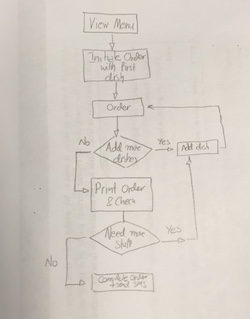

Takeaway Challenge
==================
```
                            _________
              r==           |       |
           _  //            |  M.A. |   ))))
          |_)//(''''':      |       |
            //  \_____:_____.-------D     )))))
           //   | ===  |   /        \
       .:'//.   \ \=|   \ /  .:'':./    )))))
      :' // ':   \ \ ''..'--:'-.. ':
      '. '' .'    \:.....:--'.-'' .'
       ':..:'                ':..:'

 ```

 ### Prerequisites
 This project requires the Twilio RubyGem [[more info](https://github.com/twilio/twilio-ruby)]

 All prerequisites are available by running the command ```$ bundle```.

 You will need to run the command ```$ gem install bundle``` if you don't have bundle already installed.

 ---

 ### How I approached & solved this Challenge
 1. Read user stories and start generating a flow Diagram
 2. Start creating the required Classes, so that we can adhere Single Responsibility Principle
 3. Prior to writing any code, stat writing the unit test as per user stories
 4. Ensure that the simplest code, to pass the test is written and refactor
 5. Move to the next unit testing
 6. Whenever a new Class is generated, when moving functionality from one Class to another refactor

 ---
### Related Files
* **menu.rb** : includes the list of dishes
* **takeaway.rb** : is the front-end file of the program
* **order.rb** : handles all aspects of the order generation process
* **message.rb** : handles the notification sms generation and delivery
* **secret_data.rb** : stores the Twilio account and auth tokens (not uploaded to github for security reasons)

---

### Flow Diagram


---

### Further Work
* Improve so that list of dishes can be loaded from CSV
* Create an interactive front-end
* Use stubs & doubles for testing (at the moment, a dummy return has been created with the **message.rb**)
* Investigate more edge cases (e.g. dish requested not existing)
* Add a method to be able to correct errors in total cost of order.
