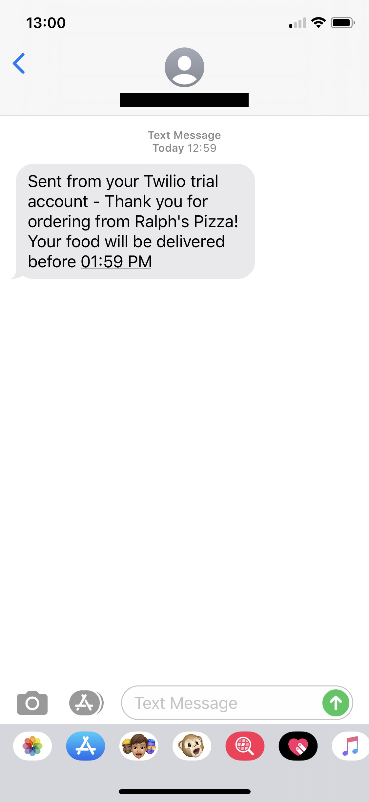

Takeaway Challenge
==================
```
                            _________
              r==           |       |
           _  //            |  M.A. |   ))))
          |_)//(''''':      |       |
            //  \_____:_____.-------D     )))))
           //   | ===  |   /        \
       .:'//.   \ \=|   \ /  .:'':./    )))))
      :' // ':   \ \ ''..'--:'-.. ':
      '. '' .'    \:.....:--'.-'' .'
       ':..:'                ':..:'

 ```

Task
-------

This involved the creation of an takeaway ordering service written in Ruby using TDD.

My approach was to first ensure all of the 4 user stores below were met, and then to defend against edge cases.

```
As a customer
So that I can check if I want to order something
I would like to see a list of dishes with prices

As a customer
So that I can order the meal I want
I would like to be able to select some number of several available dishes

As a customer
So that I can verify that my order is correct
I would like to check that the total I have been given matches the sum of the various dishes in my order

As a customer
So that I am reassured that my order will be delivered on time
I would like to receive a text such as "Thank you! Your order was placed and will be delivered before 18:52" after I have ordered
```

Progress
---------

My code satisfies all of the above user stories and does defend against some edge cases such as displaying a basket or order total when no items have been added, attempted to place an order with no items, and attempting to order an item not included on the menu.

See examples below;

```
➜  takeaway-challenge git:(master) ✗ irb
2.6.5 :001 > require './lib/order.rb'
 => true
2.6.5 :002 > sunday = Order.new
 => #<Order:0x00007fecf2914768 @menu=#<Takeaway:0x00007fecf2914678 @menu={"meat feast"=>5.99, "marinara"=>3.99, "mexican"=>4.99, "fully_loaded"=>8.99, "veg_supreme"=>6.99}>, @order_items=[], @order_total=[], @running_total=0>
2.6.5 :003 > sunday.menu
 => #<Takeaway:0x00007fecf2914678 @menu={"meat feast"=>5.99, "marinara"=>3.99, "mexican"=>4.99, "fully_loaded"=>8.99, "veg_supreme"=>6.99}>
2.6.5 :004 > sunday.add_to_order('Chicken Wings', 2)
Traceback (most recent call last):
        5: from /Users/student/.rvm/rubies/ruby-2.6.5/bin/irb:23:in `<main>'
        4: from /Users/student/.rvm/rubies/ruby-2.6.5/bin/irb:23:in `load'
        3: from /Users/student/.rvm/rubies/ruby-2.6.5/lib/ruby/gems/2.6.0/gems/irb-1.0.0/exe/irb:11:in `<top (required)>'
        2: from (irb):4
        1: from /Users/student/Documents/Projects/Week2/takeaway-challenge/lib/order.rb:18:in `add_to_order'
RuntimeError (Item does not exist)
```

```
➜  takeaway-challenge git:(master) ✗ irb
2.6.5 :001 > require './lib/order.rb'
 => true
2.6.5 :002 > sunday = Order.new
 => #<Order:0x00007fbbc01cff10 @menu=#<Takeaway:0x00007fbbc01cfee8 @menu={"meat feast"=>5.99, "marinara"=>3.99, "mexican"=>4.99, "fully_loaded"=>8.99, "veg_supreme"=>6.99}>, @order_items=[], @order_total=[], @running_total=0>
2.6.5 :003 > sunday.place_order
Traceback (most recent call last):
        6: from /Users/student/.rvm/rubies/ruby-2.6.5/bin/irb:23:in `<main>'
        5: from /Users/student/.rvm/rubies/ruby-2.6.5/bin/irb:23:in `load'
        4: from /Users/student/.rvm/rubies/ruby-2.6.5/lib/ruby/gems/2.6.0/gems/irb-1.0.0/exe/irb:11:in `<top (required)>'
        3: from (irb):3
        2: from /Users/student/Documents/Projects/Week2/takeaway-challenge/lib/order.rb:44:in `place_order'
        1: from /Users/student/Documents/Projects/Week2/takeaway-challenge/lib/order.rb:49:in `order_message'
RuntimeError (Basket empty)
```

My code is also able to send an SMS order confirmation using the twilio gem. I was not able to add unit test for this behaviour so my next step would be to implement these, as well as adding toubles to current tests.



The sms file has been amended to use variables stored in the .env file (using dotenv gem) to not expose sensitive information.

I would also like my 'display_order' method to display a total price for each item, at present it only shows the quantity.  
