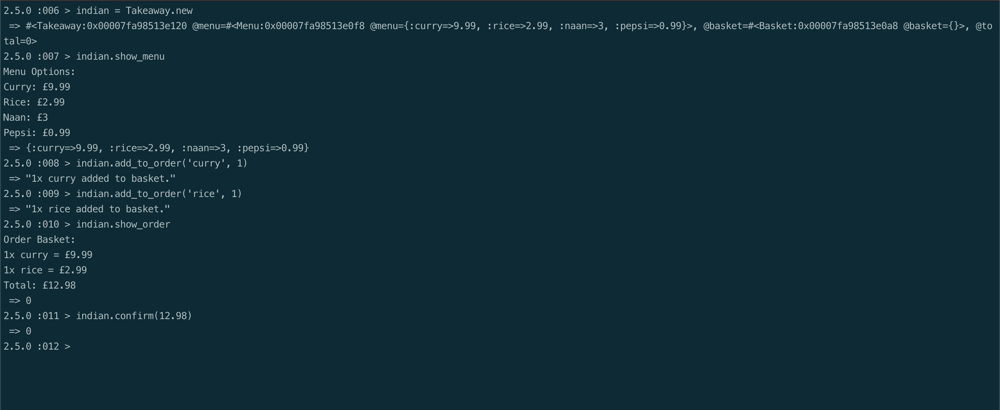
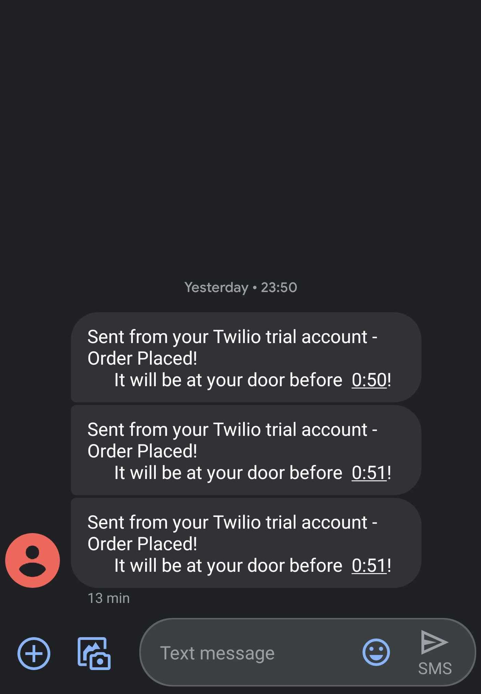

# Takeaway Challenge

```
                            _________
              r==           |       |
           _  //            |  M.A. |   ))))
          |_)//(''''':      |       |
            //  \_____:_____.-------D     )))))
           //   | ===  |   /        \
       .:'//.   \ \=|   \ /  .:'':./    )))))
      :' // ':   \ \ ''..'--:'-.. ':
      '. '' .'    \:.....:--'.-'' .'
       ':..:'                ':..:'

 ```

## About

This repository is for the second weekend challenge at Makers Academy. The program is a command line application that mimicks ordering from a takeaway. Final step is receiving a confirmation SMS via Twilio service.

You will need bundler installed on your machine to install dependencies. If not installed run command:
```
$ gem install bundler
```
Once installed run ```bundle``` from inside the project directory.

Program uses the ```gem 'twilio-ruby'``` which will be installed when running ```bundle```.

To run the program in IRB just ```require './lib/takeaway.rb'```

## User stories

```
As a customer
So that I can check if I want to order something
I would like to see a list of dishes with prices

As a customer
So that I can order the meal I want
I would like to be able to select some number of several available dishes

As a customer
So that I can verify that my order is correct
I would like to check that the total I have been given matches the sum of the various dishes in my order

As a customer
So that I am reassured that my order will be delivered on time
I would like to receive a text such as "Thank you! Your order was placed and will be delivered before 18:52" after I have ordered
```

The user can run the following 4 commands to satisfy the stories above.

* ```.show_menu``` to see a list of delicious items available to order.
* ```.add_to_order('dishname', quantity)``` to add delicious item to your order.
* ```.show_order``` to see your basket and total so far.
* ```.confirm(total)``` to checkout and receive your confirmation SMS.




## Process

I started off by writing and diagraming out the user stories. I wanted to practise using domain modelling and class diagrams. This helped me form the shape of the program. I initially started with a Takeaway class and a Menu class. Working from this base allowed me to add extra classes such as Basket at a later date. Starting by using modelling really helped clarify the process in my mind and helped form the code I wrote.

Adding in the Twilio API was an interesting challenge. In order for me to not commit my personal details to a public space I researched environment variables.  This allowed me to save sensitive data such as the account SID locally and have the program read from there.
