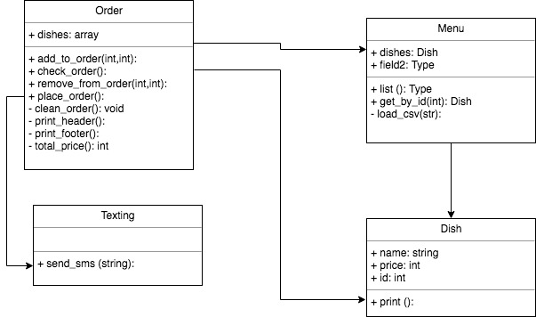

# Takeaway Challenge

For this Challenge we are going to make a takeaway application for a customer. We will focus on TDD and OOD to find a solution for the Challenge.

### User stories
>As a customer
So that I can check if I want to order something
I would like to see a list of dishes with prices

>As a customer
So that I can order the meal I want
I would like to be able to select some number of several available dishes

>As a customer
So that I can verify that my order is correct
I would like to check that the total I have been given matches the sum of the various dishes in my order

>As a customer
So that I am reassured that my order will be delivered on time
I would like to receive a text such as "Thank you! Your order was placed and will be delivered before 18:52" after I have ordered

### Approach
The solution we have think in involves four different classes handling different responsibilities of the problem.

We have a `Dish` class only responsible of storing the name, id and price of each different dish (one instance per dish) and printing its contents when listing is needed.

We will also have a `Menu` class, which be instantiated once per order, will be responsible of initializiong and storing the new dishes, loading them from a menu.csv file. Listing its content of dishes (delegating to `Dish`) and finding a dish by its ID will be the other methods of this class.

The main class will be `Order` with will be initialized with a menu object to choose from. It will store the desired dishes with quantities, giving methods to add and remove from this list, print the current order with its total price and placing the order (using the class method from `Texting`).

The last class, `Texting`, will be only responsible to load the variables needed to work will Twillio (using the "dotenv" gem) and send a SMS text with the order confirmation.

#### Dish
In this class we will store the information of the dish (name, price and id) and puts methods to print it.

#### Menu
We will have a list of the available dishes for the customer to select from. Will give the desired dish by id when requested by the order.

#### Order
Give the tools to the customer to add, remove, check and place the order. It will have one dish item per quantity, given by menu.
