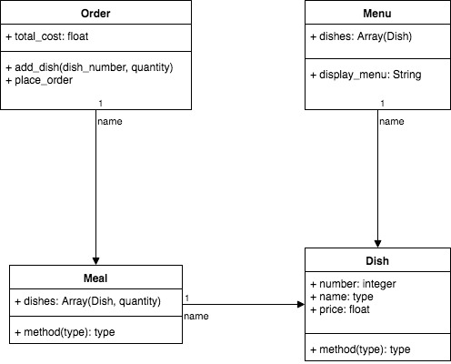

# Takeaway Challenge

```
                            _________
              r==           |       |
           _  //            |  M.A. |   ))))
          |_)//(''''':      |       |
            //  \_____:_____.-------D     )))))
           //   | ===  |   /        \
       .:'//.   \ \=|   \ /  .:'':./    )))))
      :' // ':   \ \ ''..'--:'-.. ':
      '. '' .'    \:.....:--'.-'' .'
       ':..:'                ':..:'
```

Build a takeaway application that allows a user to:

- see a menu
- order items from the menu
- see the total price
- place the order
- receive a text message confirming the order

## How to run the code

- `clone` this repository
- `bundle` to install dependencies
- `rspec` to run tests
- `rubocop` to check style guidelines
- `irb` or `pry` to play with takeaway

## Design

I initially approached the problem by briefly describing the requirements and extracting potential classes:

Display `Menu`

`Order` a `Meal` - select several `Dishes` with quantities

Check total - verify sum of price of `Dishes` is equal to the total cost

Place `Order` - receive text `Message`

I then drew a class diagram to get an idea of how the classes might be related and what responsibilities and data they would have:



_**Note:** this was just an initial attempt and the actual classes used in the application were a little different._

## Test Drive in IRB / PRY

To give you an idea about how you would use the application, here is a walk through of ordering food from the takeaway:

```ruby
[1] pry(main)> require './lib/takeaway'
=> true

[2] pry(main)> takeaway = Takeaway.new({})
=> #<Takeaway:0x00007ffda2a5fe90
 @menu=
  #<Menu:0x00007ffda2a5fe68
   @dishes=
    [#<struct Menu::Dish name="tasting platter (for two people)", price=18.2>,
     ...,
     #<struct Menu::Dish name="shredded chicken smoked with beechwood", price=5.65>]>,
 @order=
  #<Order:0x00007ffda2a5f738
   @basket=[],
   @sms=
    #<SMS:0x00007ffda2a5f7d8
     @client=
      #<Twilio::REST::Client:0x00007ffda2a5f7b0
       ...,
 @sms=
  #<SMS:0x00007ffda2a5f7d8
   @client=
    #<Twilio::REST::Client:0x00007ffda2a5f7b0


[3] pry(main)> dishes = takeaway.dishes
=> [#<struct Menu::Dish name="tasting platter (for two people)", price=18.2>,
 #<struct Menu::Dish name="steamed dim sum platter", price=11.6>,
 #<struct Menu::Dish name="peking duck", price=54.95>,
 #<struct Menu::Dish name="classic crispy aromatic duck (quarter)", price=10.45>,
 #<struct Menu::Dish name="crispy aromatic lamb", price=9.45>,
 #<struct Menu::Dish name="vegetarian lettuce wrap", price=8.2>,
 #<struct Menu::Dish name="raw vegetable salad", price=5.25>,
 #<struct Menu::Dish name="crispy vegetable spring rolls (4)", price=4.6>,
 #<struct Menu::Dish name="crispy prawn rolls (4)", price=4.6>,
 #<struct Menu::Dish name="classic sesame prawn toast (4)", price=4.6>,
 #<struct Menu::Dish name="grilled vegetable gyozas (4)", price=4.8>,
 #<struct Menu::Dish name="steamed crystal prawn dumplings (4)", price=4.8>,
 #<struct Menu::Dish name="pan-fried tofu", price=4.6>,
 #<struct Menu::Dish name="deep-fried soft-shell crab", price=8.35>,
 #<struct Menu::Dish name="deep-fried squid", price=6.5>,
 #<struct Menu::Dish name="spare ribs in capital sauce", price=6.5>,
 #<struct Menu::Dish name="spare ribs in honey sauce", price=6.5>,
 #<struct Menu::Dish name="pan-fried spare ribs", price=6.5>,
 #<struct Menu::Dish name="marinated chicken satay skewers (4)", price=5.65>,
 #<struct Menu::Dish name="shredded chicken smoked with beechwood", price=5.65>]

[4] pry(main)> takeaway.add_to_basket(dishes[3], 1)
=> "1 * classic crispy aromatic duck (quarter) = £10.45"

[5] pry(main)> takeaway.add_to_basket(dishes[5], 3)
=> "3 * vegetarian lettuce wrap = £8.2"

[6] pry(main)> takeaway.add_to_basket(dishes[6], 1)
=> "1 * raw vegetable salad = £5.25"

[7] pry(main)> takeaway.add_to_basket(dishes[9], 2)
=> "2 * classic sesame prawn toast (4) = £4.6"

[8] pry(main)> takeaway.total_price
=> 49.5

[9] pry(main)> takeaway.place_order
=> "Thank you! Your order was placed and will be delivered before 23:52"
```

## Process

I began with writing a user story feature test. This required asking what dishes were on the menu. Once I had a failing feature test I wrote corresponding unit tests for a menu class. Once, both feature and unit tests were failing for the same reason I wrote the code to pass the failing tests. I continued like this for the remaining user stories and unit tests discovering the required classes and implementing them to pass the tests.

When I came to implement the Order class I added the Twilio gem and configured the code. I read the online documentation in order to set it up correctly. I hid sensitive information in an `config.env` file so that it would not be publicly available. I posted an example file on github so that others could see the format and the required information and then added the file to `.gitignore` so that my real credentials would not be pushed to github. When testing the SMS functionality, I used a double (mock) and stubbed the `send` method so that real text messages were not sent with each test order. I made the unit test for sms messaging pending once I had gotten it to work so that a text message was not sent with each `rspec` run.

Once I had the basic functionality working across classes I wrote an end to end feature test. It was a little awkward using the classes that I had so I created a `Takeaway` class to help control the overall flow. The methods on the `Takeaway` class mostly delegated to the other classes but provided a cleaner interface.

I enabled dependency injection so that either custom or default objects for `Order`, `Menu` and `SMS` could be used.

Test coverage was 99% - This was because I set the sms test to be pending. Otherwise, it would have been 100%

Rubocop gave 2 warnings for too many lines. This was unavoidable because I needed to add lots of items to the menu.

## Future Work

I didn't have time to take the challenge any further this weekend. If I had, I could have:

- Provided a nicely formatted way of displaying a menu

- Tested edge cases and raise errors for invalid requests and ill-formatted data

- DRY'ed out my tests. I used a method `one_hours_time` to format time 1 hour in the future, and used it in several places. This could have been placed in a module.

- Provided a nice way of seeing the contents of the basket

- Provided a way to delete items from the basket
