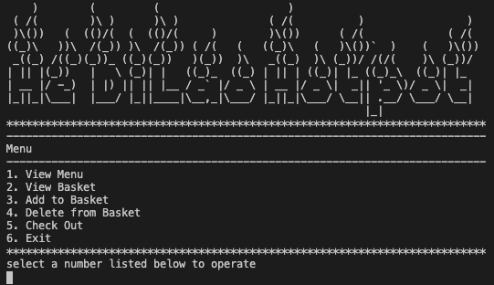
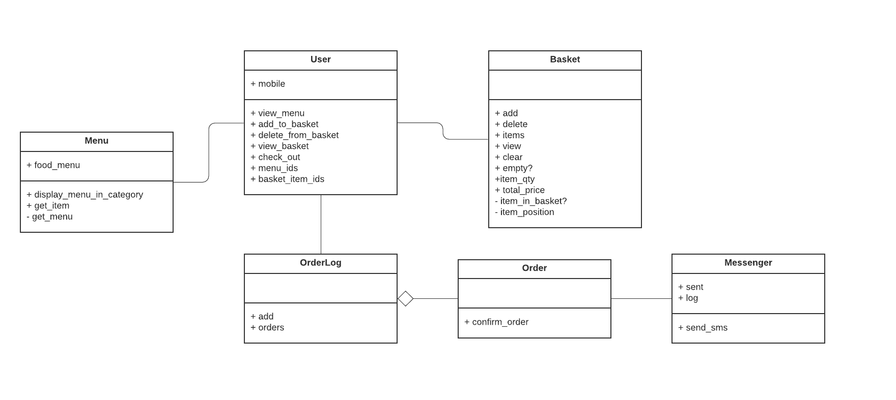

# Takeaway - HeDiLao Hotpot

*A basic command line app to manage online orders for HeDiLao Hotpot*

---------
### Functions

1. **View Menu**: show menu sectioned by category
2. **View Basket**: show items and quantity in basket plus total price
3. **Add To Basket**: add a dish to basket (can add the same dish multiple times to increase the quantity)
4. **Delete from Basket**: remove a dish from basket (1 quantity at a time)
5. **Check Out**: clear basket and send a text message with delivery expectation

---------
### How to use

1. [Setup](docs/setup.md)
2. Run "ruby hedilao.rb" in command line
3. Follow menu

---------
### UML Diagram

---------
### Issues

- rspec 98.10% coverage due to 45.45% coverage on Order.rb. However, if run rspec on the individual file, it gives 100% coverage.

---------
### Future Scopes

- Order using text messages
- Currently, use menu.csv to hold a fixed menu, can use database instead
- Add extra functions for user: login, payment, cancel order
- Add admin functions for restaurant: manage menu and orders
- Handle multiple restaurants and users

