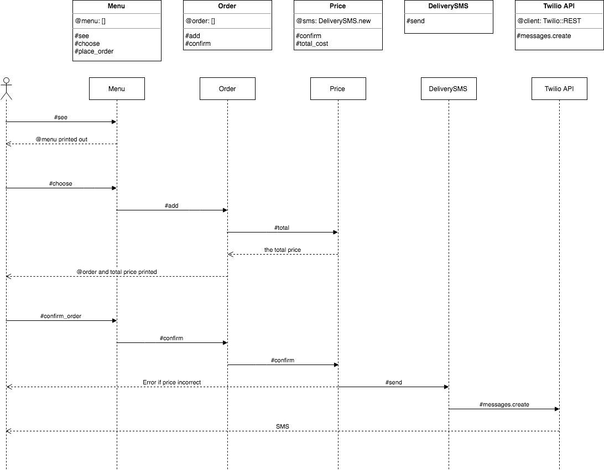

Takeaway Challenge
==================


User Stories
------------

```
As a customer
So that I can check if I want to order something
I would like to see a list of dishes with prices

As a customer
So that I can order the meal I want
I would like to be able to select some number of several available dishes

As a customer
So that I can verify that my order is correct
I would like to check that the total I have been given matches the sum of the various dishes in my order

As a customer
So that I am reassured that my order will be delivered on time
I would like to receive a text such as "Thank you! Your order was placed and will be delivered before 18:52" after I have ordered
```

Strategy
--------

1. My first step was to breakdown the user stories into Objects and Messages.
2. Then I created a Sequence and Class diagram detailing how the Class interact.
3. I built the system with an IRB interface.
4. Then I investigated the Twilio API and implemented a text response when an order was submitted and verified.
5. Finally, I investigated POST requests and implemented a rudimentary SMS interface.


Diagrams
--------



IRB print_out showing IRB interface
-----------------------------------
```
2.5.0 :001 > menu = Menu.new

2.5.0 :002 > menu.see


Hogwarts Express Trolley

1. Bertie Bott's Every Flavour Beans:                                  7 sickles
2. Cauldron Cakes:                                                     6 sickles
3. Chocolate Frogs:                                                    5 sickles
4. Drooble’s Best Blowing Gum:                                        10 sickles
5. Pumpkin Pasties:                                                    5 sickles
6. Licorice Wands:                                                     9 sickles


2.5.0 :003 > menu.choose("Chocolate Frogs", 6)


Current order:

6 Chocolate Frogs

Total: 30 silver sickles


2.5.0 :004 > menu.choose("Bertie Bott's Every Flavour Beans", 1)


Current order:

6 Chocolate Frogs
1 Bertie Bott's Every Flavour Beans

Total: 37 silver sickles


2.5.0 :005 > menu.confirm_order(40)

PriceError (Difference in Price between Customer and Vendor)

2.5.0 :006 > menu.confirm_order(37)

Text sent saying "Thank you! Your order was placed and will be delivered by Owl before 20:19."

```
