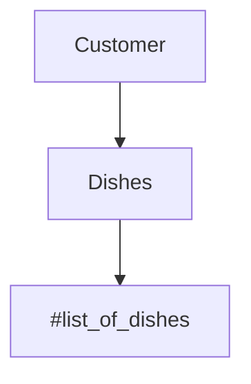
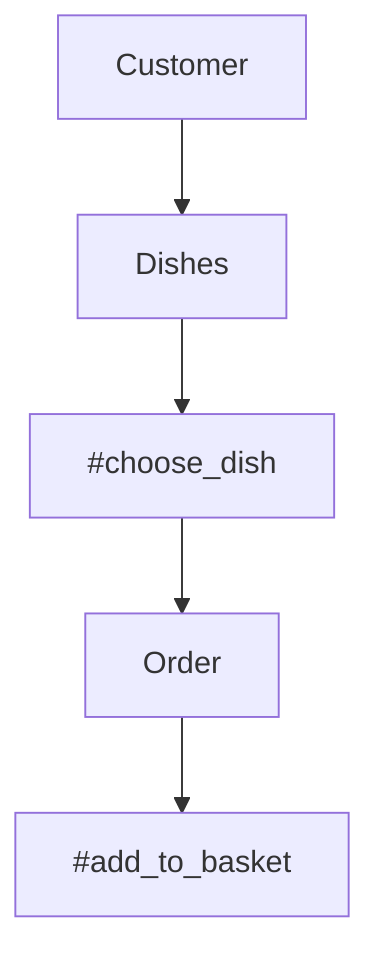
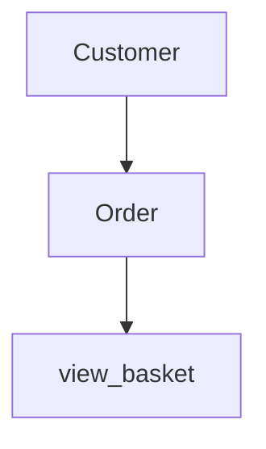

Takeaway Challenge
==================
```
                            _________
              r==           |       |
           _  //            |  M.A. |   ))))
          |_)//(''''':      |       |
            //  \_____:_____.-------D     )))))
           //   | ===  |   /        \
       .:'//.   \ \=|   \ /  .:'':./    )))))
      :' // ':   \ \ ''..'--:'-.. ':
      '. '' .'    \:.....:--'.-'' .'
       ':..:'                ':..:'

 ```

## Task

We have a request from a client to write the software to control the flow of planes at an airport. The planes can land and take off provided that the weather is sunny. Occasionally it may be stormy, in which case no planes can land or take off.

I approached this challenge by using a test driven approach:

Create a domain model and diagram from the user story
Feature test the the user story via irb
Create a failing test (red) in rspec
Develop code to result in a passing test (green) in rspec
Refactor the code and re-test in rspec (orange)
Feature test the code in irb
Once I have 1) high coverage, 2) passing rspec tests, 3) code that fulfills the user story. I will progress to the next user story and repeat steps 1-7

## Getting started

1) git clone path-to-repo
2) Install bundler via `gem install bundle` (if you don't have bundler already)
3) Install dependencies via `bundle`

## Test Code

Run rspec from the main directory to test the code and check coverage

## Run

Run code using irb

`require .... # FILE NAME
`require .... # FILE NAME

## User Stories, Domain Models and Mermaid Diagrams

`As a customer
So that I can check if I want to order something
I would like to see a list of dishes with prices`

|  Objects        |  Messages      |
| ----------      | -------------  | 
| Customer        |                |
| Dishes          | list_of_dishes |



`As a customer
So that I can order the meal I want
I would like to be able to select some number of several available dishes`

|  Objects        |  Messages      |
| ----------      | -------------  | 
| Customer        |                |
| Dishes        |   choose_dish    |
| Order           | add_to_basket |



`As a customer
So that I can verify that my order is correct
I would like to check that the total I have been given matches the sum of the various dishes in my order`

|  Objects        |  Messages      |
| ----------      | -------------  | 
| Customer        |                |
| Order           | view_basket |



`As a customer
So that I am reassured that my order will be delivered on time
I would like to receive a text such as "Thank you! Your order was placed and will be delivered before 18:52" after I have ordered`

|  Objects        |  Messages      |
| ----------      | -------------  | 
| Customer        |                |
| Order           | view_basket |

