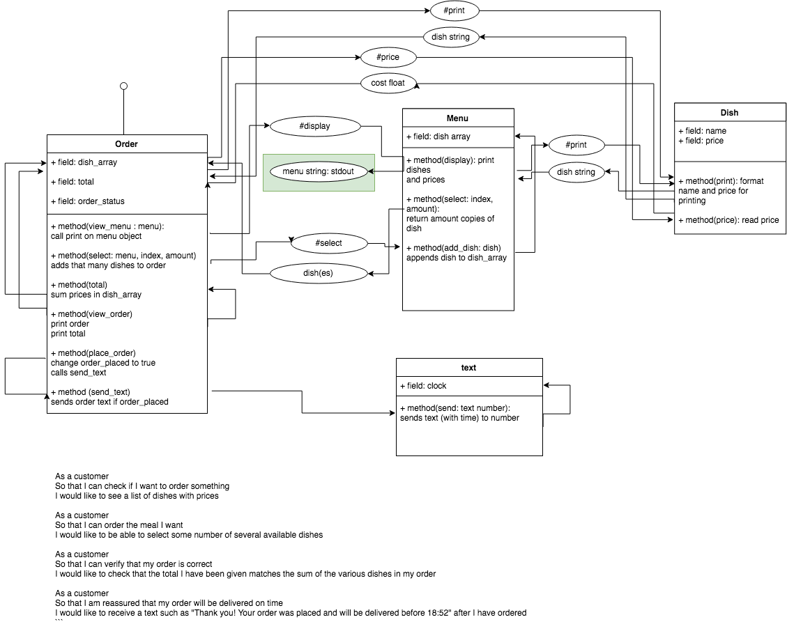

# Takeaway Challenge (Makers Weekend Challenge #2)

## Contents

## Getting Started

1) Clone or download and unzip repository.
2) run bundle install to install dependencies listed in Gemfile
2) from the root directory, run irb or pry. They .pryrc or .irbrc config files  
will load all dependencies automatically.

## Instructions for use

## Testing

All tests were designed and run using the rspec framework. If the rspec gem is installed, they can be run from terminal in the main repository folder using the **rspec** command.

## MODELLING ##

