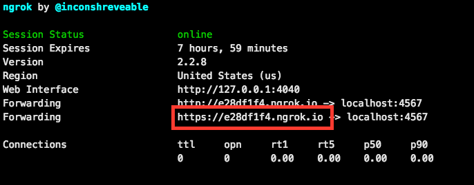
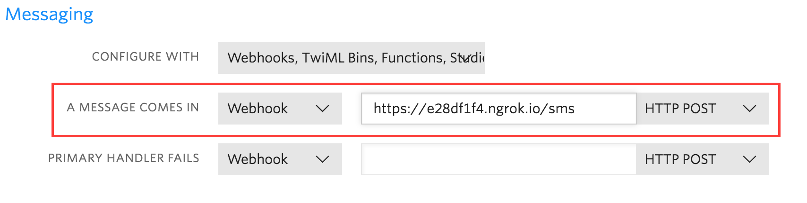

## Takeaway Challenge (Makers Academy - Week 2)

### [Introduction](#introduction) | [Setup](#setup) | [Run](#run) | [Examples](#examples)

## Introduction
This is the weekend challenge set after week 2 at [Makers Academy](https://makers.tech/). Working individually the task was to create a Takeaway application based on the following user stories:
```
As a customer
So that I can check if I want to order something
I would like to see a list of dishes with prices

As a customer
So that I can order the meal I want
I would like to be able to select some number of several available dishes

As a customer
So that I can verify that my order is correct
I would like to check that the total I have been given matches the sum of the various dishes in my order

As a customer
So that I am reassured that my order will be delivered on time
I would like to receive a text such as "Thank you! Your order was placed and will be delivered before 18:52" after I have ordered
```

## Setup

##### prerequisites

* [ngrok](https://ngrok.com/) installed locally.
For Macs users use [homebrew](https://brew.sh/).
```
$ brew cask install ngrok
```
* registered [twilio](https://www.twilio.com/) account

##### clone  and install
```
$ git clone https://github.com/toddpla/takeaway-challenge.git

$ bundle
```

## Run

##### start local server

```
$ ruby './lib/twilio.rb'
```

<!-- [](https://asciinema.org/a/m0s3gCALX6e3tb2qDwy0RwQzx) -->

##### open another terminal for ngrok tunnel
```
$ ngrok http 4567
```
This creates a tunnel to the localhost.

Copy the forwarding url.




##### configure twilio accout settings

Paste this url in the twilio webhook for **A MESSAGE COMES IN** and set the HTTP method to **POST**

Make sure to add **/sms** to the end of the url.


