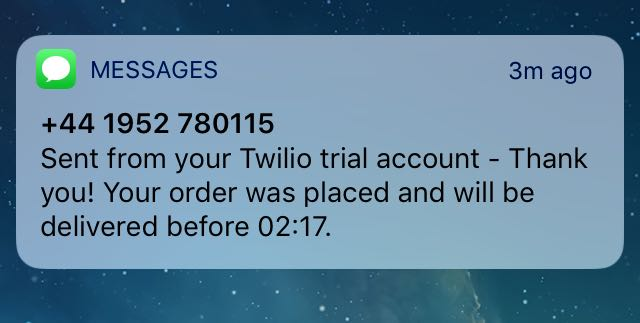

## Description
This project models a takeaway app. It can be used by multiple users:
  * By users to create orders, add items to their cart (or remove them) and pay for their order.
  * By the Takeaway app staff who can add and remove restaurants as well as see all existing restaurants.
  * By restaurant owners themselves who can manage their menu by adding and removing dishes.
 When confirming an order, the project also includes a feature for sending an SMS (using Twilio) to the user confirming the order and estimating delivery time. For this feature to work, one extra file needs to be added and it should include details from your Twilio account. This file was not added to Github for privacy reasons.
 
## Structure
The project is divided into 5 files each representing a class:
  1. Dish - This allows to create dishes, current attributes are name and price but a lot of others could be added very easily.
  2. Restaurant - This allows to create restaurants and add/remove items from their menu. From a restaurant you can also start an order.
  3. Takeaway - This is the global takeaway app class where restaurants can be added and removed. The user can see all restaurants in the takeaway app and choose one to order from.
  4. Order - This class allows users to add and remove items to their orders as well as paying and confirming an order
  5. SMS - This class deals exclusively with SMS notifications.
  
## Workflow
Below we can see the workflow of how the program works divided into two parts:
  1. Building the Takeaway app
  2. Ordering
  
#### Building the Takeaway app
  
1. We can start by creating a new Takeaway app, let's call it OberEats
```
[3] pry(main)> OberEats=Takeaway.new
=> #<Takeaway:0x007fd27f092cd0 @restaurants=[]>
```
2. Let's see if OberEats has signed-up any restaurants:
```
[4] pry(main)> OberEats.print_restaurants
=> []
```
3. That's not great for OberEats. We need to start getting restaurants into the platform so let's first create two of them: mcdonalds and pizza_hut:
```
[7] pry(main)> pizza_hut=Restaurant.new("pizza hut")
=> #<Restaurant:0x007fd27e9792a0 @menu=[], @name="pizza hut">
[8] pry(main)> mcdonalds=Restaurant.new("mcdonalds")
=> #<Restaurant:0x007fd27f0a12d0 @menu=[], @name="mcdonalds">
```
4. OberEats is very persuasive so it managed to add both of them to their restaurant portfolio:
```
[6] pry(main)> OberEats.add(mcdonalds)
=> [#<Restaurant:0x007feeba1492f8 @menu=[], @name="mcdonalds">]
[7] pry(main)> OberEats.add(pizza_hut)
=> [#<Restaurant:0x007feeba1492f8 @menu=[], @name="mcdonalds">, #<Restaurant:0x007feeb9822008 @menu=[], @name="pizza hut">]
```
5. If we now check the list of restaurants on OberEats, it reflects the new acquisitions:
```
[8] pry(main)> OberEats.print_restaurants
mcdonalds
pizza hut
```
6. Let's say that pizza hut no longer wants to work with OberEats. It's very easy to remove it:
```
[9] pry(main)> OberEats.remove(pizza_hut)
=> #<Restaurant:0x007feeb9822008 @menu=[], @name="pizza hut">
```
7. We now have mcdonalds at OberEats. However, if we check the menu, it's completely empty:
```
[10] pry(main)> mcdonalds.menu
=> []
```
8. Let's create some dishes and add them to mcdonalds - the two arguments are name and price:
```
[13] pry(main)> burger=Dish.new("burger",5)
=> #<Dish:0x007feeb89a38b0 @name="burger", @price=5>
[14] pry(main)> cheeseburger=Dish.new("burger",6)
=> #<Dish:0x007feeb8933e70 @name="cheeseburger", @price=6>
[15] pry(main)> mcdonalds.add(burger)
=> [#<Dish:0x007feeb89a38b0 @name="burger", @price=5>]
[16] pry(main)> mcdonalds.add(cheeseburger)
=> [#<Dish:0x007feeb89a38b0 @name="burger", @price=5>, #<Dish:0x007feeb8933e70 @name="cheeseburger", @price=6>]
```
9. Let's say we added pizza by mistake, it's very easy to remove it from the menu:
```
[17] pry(main)> pizza=Dish.new("pizza",4)
=> #<Dish:0x007feeba069478 @name="pizza", @price=4>
[18] pry(main)> mcdonalds.add(pizza)
=> [#<Dish:0x007feeb89a38b0 @name="burger", @price=5>,
 #<Dish:0x007feeb8933e70 @name="cheeseburger", @price=6>,
 #<Dish:0x007feeba069478 @name="pizza", @price=4>]
[19] pry(main)> mcdonalds.remove(pizza)
=> #<Dish:0x007feeba069478 @name="pizza", @price=4>
```
10. And this could go on and on for different dishes, restaurants and even takeaway apps! Let's now move to part 2, orders!

#### Ordering

1. Let's first see what's on offer on OberEats...
```
[20] pry(main)> OberEats.print_restaurants
mcdonalds
```
2. What? There's only mcdonalds...normally I would never eat here but I am starving so let's create an order:
```
[23] pry(main)> order=mcdonalds.start_order
=> #<Order:0x007feeb939e7c0
 @id=1,
 @items=[],
 @restaurant=
  #<Restaurant:0x007feeba1492f8
   @menu=[#<Dish:0x007feeb89a38b0 @name="burger", @price=5>, #<Dish:0x007feeb8933e70 @name="cheeseburger", @price=6>],
   @name="mcdonalds">,
 @total=0>
 ```
 3. Wow! Those are a lot of attributes but I'll summarize quickly: we have a unique order ID, an array of items and a total which will be updated as we update our order, and the restaurant instance to which this order belongs to. Let's start adding items:
 ```
[24] pry(main)> order.add_item("pizza")
RuntimeError: This item doesn't exist at this restaurant.
```
4. Completely forgot that mcdonalds doesn't have pizza! Let's add a burger!
```
[26] pry(main)> order.add_item("burger")
=> [#<Dish:0x007feeb89a38b0 @name="burger", @price=5>]
```
5. Aha! This worked! Let me just add two cheeseburgers as well as I am starving:
```
[36] pry(main)> order.add_item("cheeseburger",2)
=> [#<Dish:0x007feeb8c4b518 @name="cheeseburger", @price=6>, #<Dish:0x007feeb8c4b518 @name="cheeseburger", @price=6>]
```
6. And with so many items I completely lost track of how much I owe! Let's check that:
```
[37] pry(main)> order.check_total
Order Summary:
burger: £5
cheeseburger: £6
cheeseburger: £6
Your total is £17
```
7. That's pretty neat! That said, spending £17 at mcdonalds sounds a bit extreme...let's try and cheat the system and pay less:
```
[38] pry(main)> order.pay(15)
RuntimeError: Sorry, you are missing £2.
```
8. Man! Those folks at mcdonalds are stingy! I only have a £20 note so I am going to try that:
```
[39] pry(main)> order.pay(20)
Your order from mcdonalds is complete for £17.
Your change is £3.
=> "SMS delivered"
```
9. At least they give me change! But wait, it says SMS delivered, I just checked my phone and I did get a notification:



10. And that's about it! There are lots of things we can still do (add nutritional info to dishes, allow ordering at takeaway app level meaning we can order from multiple restaurants at the same time, allow ordering by SMS etc.) but I'll leave that to future opportunities!


