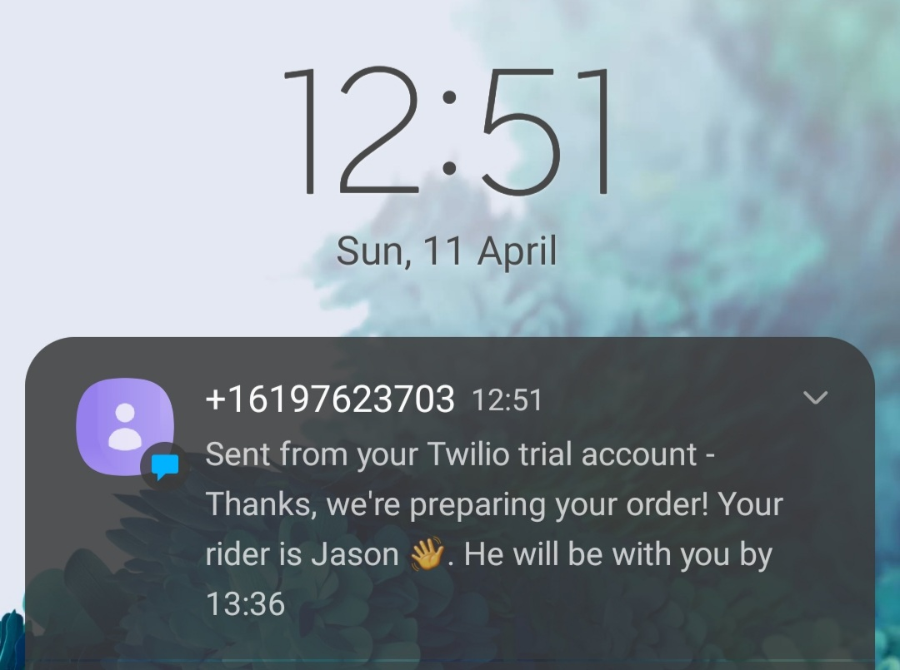

# Takeaway Challenge

During the COVID-19 pandemic, restaurants have had to adapt to online deliveries and services. Deliverooby, an online takeaway service, requires a program to be built, allowing customers to order food from the comfort of their own home. Twilio was used in this program to send a confirmation text to the customer once an order has been placed.

The features built in this project are based on [user stories.](user_stories.md)
The features built in this project are structured on a [domain model.](plan.md)



## Technical skills

- Environment Variables
- Domain modelling
- Mocking with doubles and stubs
- TDD
- OOP: Encapsulation, SRP, Dependency Injection, Polymorphism
- REST APIs

## Installation and usage

This program requires latest [Ruby](https://www.ruby-lang.org/en/downloads/) version or more recent.

## Dependencies

- `rspec` - testing
- `coveralls` - test coverage
- `rake` - CI
- `rubocop` - test coverage
- `twilio-ruby` - SMS function

### Getting started

The following commands clone and run the Takeaway program:

```sh
git clone git@github.com:jasonrowsell/takeaway-challenge.git
```

Install dependencies:

```sh
bundle
```

Run the takeaway program in a REPL environment from root directory

```shell
irb -r ./lib/runfile.rb
```

Create your resturant class

```ruby
deliverooby = Restaurant.new
```

### Running tests

```sh
rspec
```
