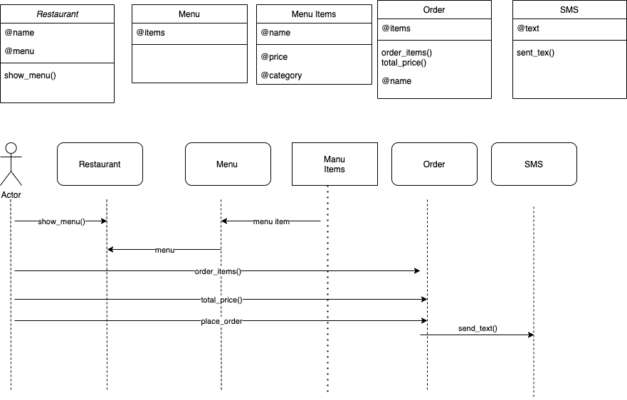

## Takeaway Challenge

```
                            _________
              r==           |       |
           _  //            |  M.A. |   ))))
          |_)//(''''':      |       |
            //  \_____:_____.-------D     )))))
           //   | ===  |   /        \
       .:'//.   \ \=|   \ /  .:'':./    )))))
      :' // ':   \ \ ''..'--:'-.. ':
      '. '' .'    \:.....:--'.-'' .'
       ':..:'                ':..:'

 ```

### Description
In this mini-project I created a command line app for ordering a takeaway, using TDD. I used the [Twilio](https://www.twilio.com/) API to send text messages confirming the order was on its way. This project was a weekend challenge for the [Makers Academy](https://makers.tech) coding bootcamp (week 2 of 12).  

These were the user stories:  
```
As a customer
So that I can check if I want to order something
I would like to see a list of dishes with prices

As a customer
So that I can order the meal I want
I would like to be able to select some number of several available dishes

As a customer
So that I can verify that my order is correct
I would like to check that the total I have been given matches the sum of the various dishes in my order

As a customer
So that I am reassured that my order will be delivered on time
I would like to receive a text such as "Thank you! Your order was placed and will be delivered before 18:52" after I have ordered
```
I decided to make several classes: Dish, Menu, Order, OrderManager, and finally TwilioManager for the API call. Each Dish has a name and price. A Menu contains several Dishes - in fact I copied various items off my favourite local takeaway's menu to load in. The OrderManager allows the user to select printed out items off the Menu by number, which are stored in an Order. Once the Order is created, the program prints out various confirmations as well as sending a text via Twilio.

This was my first experience using an API!

Test coverage is 98%.

### Installation and Usage
To try out the project:
* Make sure Ruby 2.7.2 is installed
* Clone this repo
* Navigate into the cloned folder
* Run `bundle` to install the dependencies
* Run `irb -r ./lib/order_manager`
* Play with the code in the irb REPL
* To run the tests, exit from irb
* Run `rspec`

Here's a screenshot of the code in action:

