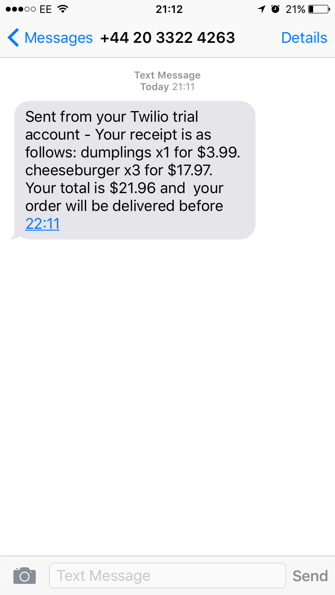

Takeaway Challenge
==================
This weekend challenge was to create a Takeaway shop.

- What I built it with
--------------------
  - I built this application in Ruby and using RubyGems.
  - A list of the gems are as follows:
    * 'rspec'
    * 'rubocop'
    * 'coveralls', require: false
    * 'rubocop-rspec'
    * 'capybara'
    * 'twilio-ruby'
    * 'dotenv'

- How to install this on your machine
---------
#### For Linux Machines:
  - You should clone the file from my Github repository and run bundle from the command line.

  - ***I have used the ```dotenv``` gem to hide the Account SID and Aunthentication token***

- Outline of my approach
------------------------
  - I followed each user story and utilized the London school of TDD.
  ```
  As a customer
  So that I can check if I want to order something
  I would like to see a list of dishes with prices
    ```
  - For the first user story (shown above) I created a Restaurant class that contains a constant called ```DEFAULT_MENU``` which contains a list of dishes with their corresponding prices.
    - Update: I created a separate menu class to handle the ```DEFAULT_MENU```

  ```
  As a customer
  So that I can order the meal I want
  I would like to be able to select some number of several available dishes
  ```
  - The second user story led me to creae an Order class, which can be considered the main point of interaction between the user and the program. In it I created a ```place_order``` method that takes two arrays: one for the food, and another for their respective quantities.

  ```
  As a customer
  So that I can verify that my order is correct
  I would like to check that the total I have been given matches the sum of the various dishes in my order
  ```

  - The third user story instructed me to compare the sum and the total, and throw an error if they are not equal, I took that as a customer paying for his food and created a ```finish_order``` method that takes an amount due.

  ```
  As a customer
  So that I am reassured that my order will be delivered on time
  I would like to receive a text such as "Thank you! Your order was placed and will be delivered before 18:52" after I have ordered
  ```
  - For the last user story, I utilized the Twilio API to allow me to send messages to the custome once the order is successfully sent to the restaurant. I created a ```Messager ``` class that would handle the Twilio API.

- Design Principles Used
--------------
  - I attempted to keep to the SOLID Principles of Object Oriented Programming. Mainly, Dependency Injection, Encapsulation and Single Responsibility Principle.

- Obstacles you encountered and how you overcame them
------------
  - A major obstacle was to figure out specific matchers for my rspec tests. Properly testing the program is neccessary and I wanted to make sure each test was properly configured for what was expected from each method.

- Example
-------------------
  ```sh
  2.2.3 :001 > require './lib/order'
      => true
  2.2.3 :002 > chuka = Order.new
  => #<Order:0x007fa095069d60 @total=0, @restaurant_klass=Restaurant, @restaurant=#<Restaurant:0x007fa095069d38 @dishes={"dumplings"=>3.99, "cheeseburger"=>5.99, "peking duck"=>10.99}, @messager_klass=Messager>, @receipt="">
  2.2.3 :003 > chuka.place_order(["dumplings","cheeseburger"],[1,3])
  => "your order has been successfully placed"
  2.2.3 :004 > chuka.total
  Your total is $21.96
  => 21.96
  2.2.3 :005 > chuka.finish_order(21.96)
  => "Thank you. A text has been sent to you with a copy of your receipt"
  ```
  - ### A text is then sent to the customers phone:
  

- Further features/improvements
--------
  - I would like to implement a "text to order" feature in the future.

- The tests you have written
--------------------
  ```ruby
  describe Restaurant do
    subject(:restaurant) { described_class.new }

    it 'should add a new item to the menu' do
      restaurant.add_item("pizza",3)
      expect(restaurant.dishes).to include("pizza")
    end

    context 'when the user has finished ordering' do
      describe '#finish' do
        before do
          allow(restaurant).to receive(:send_text)
        end
        it 'should text the user' do
          expect(restaurant).to receive(:send_text)
          restaurant.finish("your order is finished")
        end
      end
    end

  end

  describe Order do
    subject(:order) { described_class.new }
    #allow(order).to receive(:see_menu).and_return(pizza)

    it 'should allow you to see the menu' do
      expect(order.see_menu).to eq Restaurant::DEFAULT_MENU
    end

    context "when an order is placed" do
      describe "#place_order" do
        it 'should allow you select some number of several available dishes' do
          message = "your order has been successfully placed"
          expect(order.place_order(["dumplings"],[3])).to eq message
        end

        it 'should display the total of your order' do
          order.place_order(["dumplings"])
          expect(order.total).to eq((order.see_menu["dumplings"]))
        end

        it 'should raise an error if the order is not in the menu' do
          message = "Sorry but your order is currently not on the menu"
          expect{order.place_order(["eggs"],[1])}.to raise_error(message)
        end
      end
    end

    context "when you have finished ordering" do
      describe "#finish_order" do
        it 'should raise an error if the sum does not match the actual total' do
          message = "The amount given does not match the actual total"
          expect{order.finish_order(5)}.to raise_error(message)
        end
      end
    end

  end
  ```

- Badges  from the CI Build and Test Coverage
----------------
[
[](https://coveralls.io/github/ChukaEbi/takeaway-challenge?branch=master)
=======

Instructions
-------
* Feel free to use google, your notes, books, etc but work on your own
* You must submit a pull request to this repo with your code by 9am Monday morning

Task
-----

* Fill out your learning plan self review for the week: https://github.com/makersacademy/learning_plan_october2015 (if you haven't already)
* Fork this repo
* run the command 'bundle' in the project directory to ensure you have all the gems
* Write a Takeaway program with the following user stories:

```
As a customer
So that I can check if I want to order something
I would like to see a list of dishes with prices

As a customer
So that I can order the meal I want
I would like to be able to select some number of several available dishes

As a customer
So that I can verify that my order is correct
I would like to check that the total I have been given matches the sum of the various dishes in my order

As a customer
So that I am reassured that my order will be delivered on time
I would like to receive a text such as "Thank you! Your order was placed and will be delivered before 18:52" after I have ordered
```

* Hints on functionality to implement:
  * ensure you have a list of dishes with prices
  * place the order by giving the list of dishes, their quantities and a number that should be the exact total. If the sum is not correct the method should raise an error, otherwise the customer is sent a text saying that the order was placed successfully and that it will be delivered 1 hour from now, e.g. "Thank you! Your order was placed and will be delivered before 18:52".
  * The text sending functionality should be implemented using Twilio API. You'll need to register for it. It’s free.
  * Use the twilio-ruby gem to access the API
  * Use a Gemfile to manage your gems
  * Make sure that your Takeaway is thoroughly tested and that you use mocks and/or stubs, as necessary to not to send texts when your tests are run
  * However, if your Takeaway is loaded into IRB and the order is placed, the text should actually be sent

* Advanced! (have a go if you're feeling adventurous):
  * Implement the ability to place orders via text message.

* A free account on Twilio will only allow you to send texts to "verified" numbers. Use your mobile phone number, don't worry about the customer's mobile phone.
* Finally submit a pull request before Monday at 9am with your solution or partial solution.  However much or little amount of code you wrote please please please submit a pull request before Monday at 9am


**Note: We are looking for good OO design and programming! Remember the Single Responsibility and Dependency Injection/Inversion principles!**

[](https://travis-ci.org/makersacademy/takeaway-challenge)
[](https://coveralls.io/r/makersacademy/takeaway-challenge)
