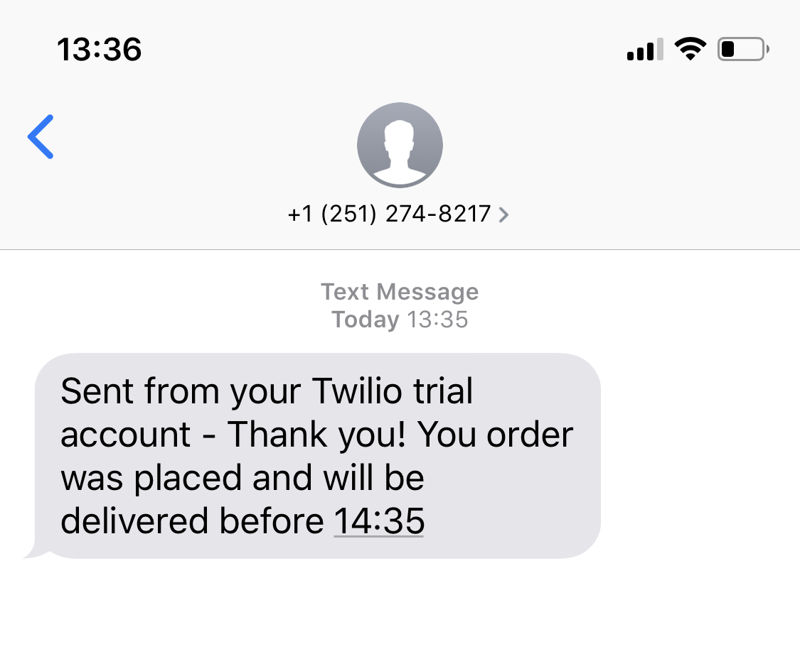

# Takeaway Challenge

This app lets customers:
- See a list of dishes with prices for a given restaurant
- Select some number of several available dishes
- Review their order including the total price
- Place an order and receive an SMS confirmation message

## How to install

Clone this repository
```shell
$ git clone git@github.com:melvinlau/takeaway-challenge.git
```

Install Bundler
```shell
$ gem install bundler
```

This command will install all this app's dependencies
```shell
$ bundle install
```

## How to use: An example

### Starting the app

```shell
$ irb
2.5.0 :001 > require "./takeaway.rb"
 => true
```

### For Restaurants

Create a restaurant and dishes, then add dishes to a menu.

```shell
2.5.0 :002 > melvinos = Restaurant.new
 => #<Restaurant:0x00007f9e804a0300 @menu=[]>

2.5.0 :003 >
2.5.0 :004 > roast_beef = Dish.new("Roast Beef", 7.80)
=> #<Dish:0x00007f9e8109ec10 @name="Roast Beef", @price=7.8>

2.5.0 :005 > fish_and_chips = Dish.new("Fish and Chips", 8.20)
=> #<Dish:0x00007f9e7fa8d9f8 @name="Fish and Chips", @price=8.2>

2.5.0 :006 > steak = Dish.new("Steak", 16.00)
=> #<Dish:0x00007f9e7fa963a0 @name="Steak", @price=16.0>

2.5.0 :007 > melvinos.add_dish(roast_beef)
 => [#<Dish:0x00007f9e8109ec10 @name="Roast Beef", @price=7.8>]

2.5.0 :008 > melvinos.add_dish(fish_and_chips)
 => [#<Dish:0x00007f9e8109ec10 @name="Roast Beef", @price=7.8>, #<Dish:0x00007f9e7fa8d9f8 @name="Fish and Chips", @price=8.2>]

2.5.0 :009 > melvinos.add_dish(steak)
 => [#<Dish:0x00007f9e8109ec10 @name="Roast Beef", @price=7.8>, #<Dish:0x00007f9e7fa8d9f8 @name="Fish and Chips", @price=8.2>, #<Dish:0x00007f9e7fa963a0 @name="Steak", @price=16.0>]

```

### For Customers

#### View a restaurant's menu

```shell
2.5.0 :010 > puts melvinos.menu
Roast Beef: 7.80
Fish and Chips: 8.20
Steak: 16.00
 => nil
```
Note: I've used `puts` for the feature test here as it displays each menu item on a separate line. Otherwise `melvinos.menu` will return an array containing the same menu items.

#### Create a new order

```shell
2.5.0 :011 > order = Order.new
```
The output of this is not shown as it contains confidential information including the customer's mobile number and authorisation tokens.

#### Add dishes to the order

Use the `add` method, passing the selected dish and quantity as arguments.

```shell
2.5.0 :012 > order.add(roast_beef, 2)
 => 2
2.5.0 :013 > order.add(steak, 1)
 => 1
2.5.0 :014 > order.add(fish_and_chips, 3)
 => 3
```

#### Review the order and the total price

```shell
2.5.0 :015 > puts order.review
Roast Beef 7.80
Roast Beef 7.80
Steak 16.00
Fish and Chips 8.20
Fish and Chips 8.20
Fish and Chips 8.20
 => nil
```
Again, `puts` was used to print each item on an individual line, but otherwise the command `order.review` would return an array.

```shell
2.5.0 :016 > order.print_total
 => "56.20"
```

#### Place the order

Place the order using the `order.place` method, and give the authorised payment amount as the argument.

```shell
2.5.0 :017 > order.place(56.2)
```

If the authorised payment matches the order total, the order will be confirmed and you will receive a confirmation message via SMS, like so:



---
# Progress Report

- Completed the weekend challenge (excluding the optional advanced challenge)
- This program was test-driven using feature tests and unit tests
- The unit tests have been isolated using mocks and stubs
- The SMS feature works

&nbsp;

Possible room for improvement:
- **More user-friendly dish references.**   
  Currently, dishes are being referenced by variable names, e.g. `roast_beef`. Users might prefer to pass in a string like `"Roast Beef"` instead. However, this would involve more edge cases (e.g. how to deal with a typo) so the ideal scenario would be to design an intuitive web or mobile interface that requires no typing.   
  &nbsp;
- **Make `Dish` objects specific to each restaurant.**  
  Currently, instances of `Dish` are universal and can be accessed by any `Restaurant`.


---


Takeaway Challenge
==================
```
                            _________
              r==           |       |
           _  //            |  M.A. |   ))))
          |_)//(''''':      |       |
            //  \_____:_____.-------D     )))))
           //   | ===  |   /        \
       .:'//.   \ \=|   \ /  .:'':./    )))))
      :' // ':   \ \ ''..'--:'-.. ':
      '. '' .'    \:.....:--'.-'' .'
       ':..:'                ':..:'

 ```

Instructions
-------

* Challenge time: rest of the day and weekend, until Monday 9am
* Feel free to use google, your notes, books, etc. but work on your own
* If you refer to the solution of another coach or student, please put a link to that in your README
* If you have a partial solution, **still check in a partial solution**
* You must submit a pull request to this repo with your code by 9am Monday morning

Task
-----

* Fork this repo
* Run the command 'bundle' in the project directory to ensure you have all the gems
* Write a Takeaway program with the following user stories:

```
As a customer
So that I can check if I want to order something
I would like to see a list of dishes with prices

As a customer
So that I can order the meal I want
I would like to be able to select some number of several available dishes

As a customer
So that I can verify that my order is correct
I would like to check that the total I have been given matches the sum of the various dishes in my order

As a customer
So that I am reassured that my order will be delivered on time
I would like to receive a text such as "Thank you! Your order was placed and will be delivered before 18:52" after I have ordered
```

* Hints on functionality to implement:
  * Ensure you have a list of dishes with prices
  * Place the order by giving the list of dishes, their quantities and a number that should be the exact total. If the sum is not correct the method should raise an error, otherwise the customer is sent a text saying that the order was placed successfully and that it will be delivered 1 hour from now, e.g. "Thank you! Your order was placed and will be delivered before 18:52".
  * The text sending functionality should be implemented using Twilio API. You'll need to register for it. It’s free.
  * Use the twilio-ruby gem to access the API
  * Use the Gemfile to manage your gems
  * Make sure that your Takeaway is thoroughly tested and that you use mocks and/or stubs, as necessary to not to send texts when your tests are run
  * However, if your Takeaway is loaded into IRB and the order is placed, the text should actually be sent
  * Note that you can only send texts in the same country as you have your account. I.e. if you have a UK account you can only send to UK numbers.

* Advanced! (have a go if you're feeling adventurous):
  * Implement the ability to place orders via text message.

* A free account on Twilio will only allow you to send texts to "verified" numbers. Use your mobile phone number, don't worry about the customer's mobile phone.

* **WARNING** think twice before you push your mobile number or any private details to a public space like Github. Now is a great time to think about security and how you can keep your private information secret. You might want to explore environment variables.

* Finally submit a pull request before Monday at 9am with your solution or partial solution.  However much or little amount of code you wrote please please please submit a pull request before Monday at 9am


In code review we'll be hoping to see:

* All tests passing
* High [Test coverage](https://github.com/makersacademy/course/blob/master/pills/test_coverage.md) (>95% is good)
* The code is elegant: every class has a clear responsibility, methods are short etc.

Reviewers will potentially be using this [code review rubric](docs/review.md).  Referring to this rubric in advance will make the challenge somewhat easier.  You should be the judge of how much challenge you want this weekend.

Notes on Test Coverage
------------------

You can see your [test coverage](https://github.com/makersacademy/course/blob/master/pills/test_coverage.md) when you run your tests.
