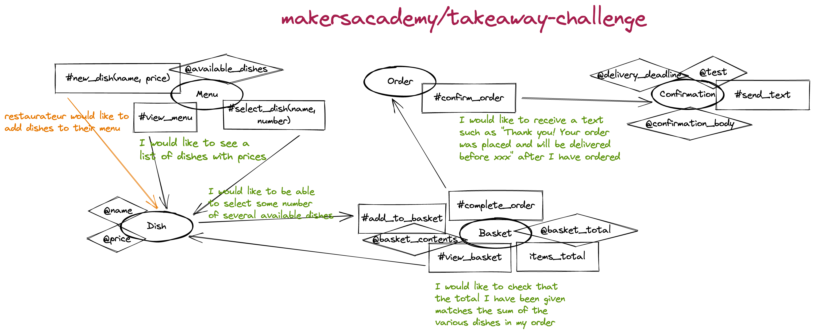

# Takeaway Challenge

This is my solution to the week 2 weekend challenge at [Maker's Academy](https://makers.tech/).

```
                            _________
              r==           |       |
           _  //            |  M.A. |   ))))
          |_)//(''''':      |       |
            //  \_____:_____.-------D     )))))
           //   | ===  |   /        \
       .:'//.   \ \=|   \ /  .:'':./    )))))
      :' // ':   \ \ ''..'--:'-.. ':
      '. '' .'    \:.....:--'.-'' .'
       ':..:'                ':..:'

 ```

 ## Task

 Write a Takeaway programm with the following user stories:

 ```
As a customer
So that I can check if I want to order something
I would like to see a list of dishes with prices

As a customer
So that I can order the meal I want
I would like to be able to select some number of several available dishes

As a customer
So that I can verify that my order is correct
I would like to check that the total I have been given matches the sum of the various dishes in my order

As a customer
So that I am reassured that my order will be delivered on time
I would like to receive a text such as "Thank you! Your order was placed and will be delivered before 18:52" after I have ordered
```

## Getting started

Fork this repo:
`https://github.com/almorcrette/takeaway-challenge`

Run `bundle` in the project directory to ensure you have all the gems

## Usage

From takeaway-challenge folder:
``` ruby
irb
require './setup.rb'
my_menu = setup_menu
require './run.rb'
run(my_menu)
```

## Running tests

From takeaway-challenge folder:
`rspec`

## File manifest

in `./`
* `setup.rb`
* `run.rb`
* `README.md`
* `INSTRUCTION.md`
* `LICENSE`
* `Gemfile`
in `./lib/`
* `dish.rb`
* `menu.rb`
* `basket.rb`
* `order.rb`
* `confirmation.rb`
in `./spec/`
* `dish_spec.rb`
* `menu_spec.rb`
* `basket_spec.rb`
* `order_spec.rb`
* `confirmation_spec.rb`
* `spec_help.rb`
* Not used `feature_spec.rb`

## My approach to the task

### Object-oriented design

#### Domain diagram



#### Functional representation


### Test Driven Development

Isolated class tests from other classes. Used Rspec

### Linting

Used Rubocop

### User interface

Prototyped (not with TDD) a user interface that can be run from `run.rb` (run `setup.rb` first to set up the menu)

----------------------------------------------

At the barest minimum, it should contain a description of what the code does, how to install it, how to use it and how to run its tests. In addition, READMEs often include other information such as:

- Configuration instructions
- A file manifest (list of files included)
- Copyright and licensing information
- Contact information for the distributor or programmer
- Known bugs
- Troubleshooting
- Credits and acknowledgments
- A changelog (usually for programmers)
- A news section (usually for users)
