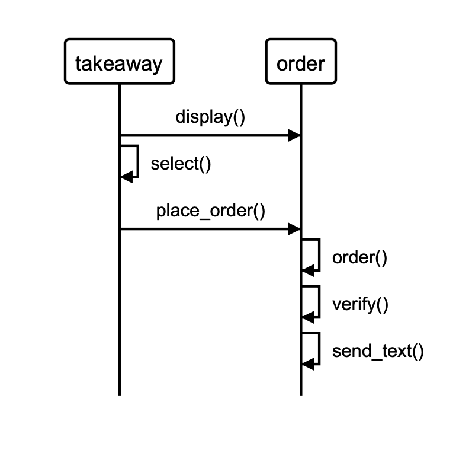

Week one - Airport TDD challenge - Hibo Abdilaahi
==================
```
                            _________
              r==           |       |
           _  //            |  M.A. |   ))))
          |_)//(''''':      |       |
            //  \_____:_____.-------D     )))))
           //   | ===  |   /        \
       .:'//.   \ \=|   \ /  .:'':./    )))))
      :' // ':   \ \ ''..'--:'-.. ':
      '. '' .'    \:.....:--'.-'' .'
       ':..:'                ':..:'

 ```

About this project
-------
This program enables a user to place orders from a set menu.

The process of the program is displayed in the following model. A description of the methods can be found below.



It includes the following features:

  * display() - enables a user to view a menu
  * select() - enables a user to place specified menu items into a basket. The method takes a unlimited number of arguments in the form of a hash with the dish name and quantity specified. See an example of this in the screenshot below.
  * place_order() - enables a user to place an order. This method takes one parameter, the expected order total. This is then verified (the expected order total referenced against the actual order total) and if this equals the actual order total, the order is placed. If the order total does not equal the actual order total, an error is raised. When the order is placed, the user will receive an SMS text message letting them know that their order has been placed and will be with them in one hour.

An example of the user journey is below:

[insert screenshot of irb output]


How to run this on your computer
-----

To run this on your computer, complete the following steps:

* Fork this repository and clone to your local computer.
* Run the command 'bundle' in the project directory to ensure you have all the gems.

You will require the following gems:

* rspec
* rubocop
* simplecov-console, require: false, group: :test
* simplecov, require: false, group: :test
* sinatra
* twilio-ruby


```
As a customer
So that I can check if I want to order something
I would like to see a list of dishes with prices

As a customer
So that I can order the meal I want
I would like to be able to select some number of several available dishes

As a customer
So that I can verify that my order is correct
I would like to check that the total I have been given matches the sum of the various dishes in my order

As a customer
So that I am reassured that my order will be delivered on time
I would like to receive a text such as "Thank you! Your order was placed and will be delivered before 18:52" after I have ordered
```

* Hints on functionality to implement:
  * Ensure you have a list of dishes with prices
  * Place the order by giving the list of dishes, their quantities and a number that should be the exact total. If the sum is not correct the method should raise an error, otherwise the customer is sent a text saying that the order was placed successfully and that it will be delivered 1 hour from now, e.g. "Thank you! Your order was placed and will be delivered before 18:52".
  * The text sending functionality should be implemented using Twilio API. You'll need to register for it. It’s free.
  * Use the twilio-ruby gem to access the API
  * Use the Gemfile to manage your gems
  * Make sure that your Takeaway is thoroughly tested and that you use mocks and/or stubs, as necessary to not to send texts when your tests are run
  * However, if your Takeaway is loaded into IRB and the order is placed, the text should actually be sent
  * Note that you can only send texts in the same country as you have your account. I.e. if you have a UK account you can only send to UK numbers.
