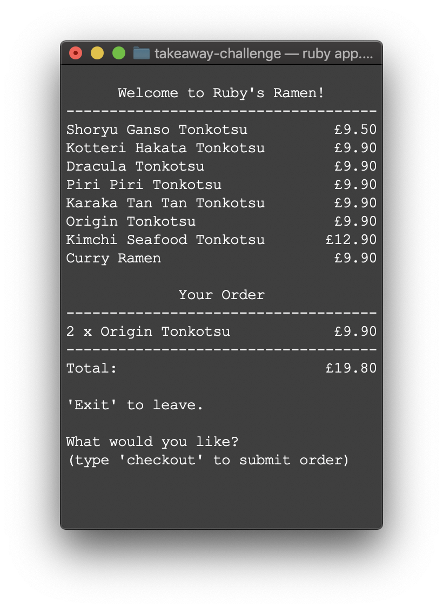

# Takeaway Challenge

Makers Week 2 (Friday) - This project is an app to order takeaway.

## Getting started

In the location of your choice, in Terminal:

`git@github.com:alittlecross/takeaway-challenge.git`

In that same location, in Terminal:

`bundler`

## Usage

In that same location, in Terminal:

`ruby app.rb`

The Terminal window should look like this:

A message will be shown if entering something that does not match the menu:

Once an item has been entered, quantity will be asked for:

Zero cannot be entered as an answer:

Item and quantity entered will be displayed under the menu, also showing the total:

Multiple items can be added to an order:

'Checkout' asks for the customer's mobile number so a text message can be sent:

**(Note: the application will only send a message if my mobile number is entered.)**

The app will close, thanking the customer for visiting:

...and the text message will be sent to the customer:

The customer cannot checkout if they have not added anything to their order:

## Running tests

In that same location, in Terminal:

`rspec`

## Linting

In that same location, in Terminal:

`rubocop`
