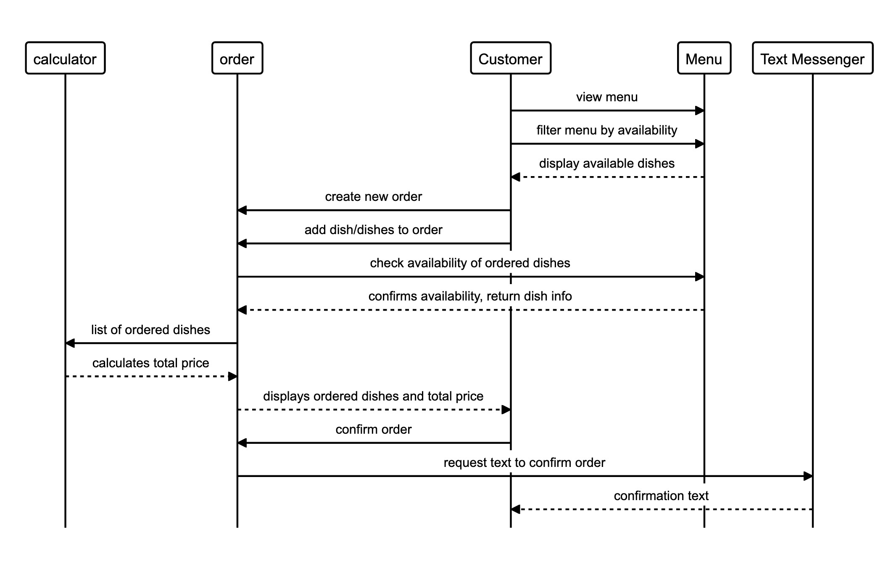

# Diagram for completing the challenge

## I create my classes
## Takeaway class, OrderSystem class and Menu class  

## Menu class includes the items
## OrderSystem class includes the total price and nr of
## the items
## For invoking the Single Responsibility Principle
## and for keeping my code clean I
## link Menu and OrderSystem class to Takeaway class
## Takeaway class includes all the procedures from
## Menu and OrderSystem class
## I initialize Takeaway class

takeaway = Takeaway.new

- Display the menu for the customer

takeaway.show_menu

- Make the order(item and quantity needed)

takeaway.order('pizza', 3)

- Display the order you made

takeaway.show_order

-  Remove the wrong item from the order

takeaway.remove_item(:pizza)

- Display the total price of your order

takeaway.show_total

- Confirm the price order and receive information about
- delivery by text message
- Introduce your phone number

takeaway.confirm(14.97) # 3 x pizza = 14.97
phone_number: 4407xxxx

- Order delivered and text message received

## Test coverage

