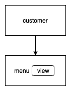

# Takeaway Challenge

```

                       .
                        `:.
                          `:.
                  .:'     ,::
                 .:'      ;:'
                 ::      ;:'
                  :    .:'
                   `.  :.
          _________________________
         : _ _ _ _ _ _ _ _ _ _ _ _ :
     ,---:".".".".".".".".".".".".":
    : ,'"`::.:.:.:.:.:.:.:.:.:.:.::'
    `.`.  `:-===-===-===-===-===-:'
      `.`-._:                   :
        `-.__`.               ,'
    ,--------`"`-------------'--------.
     `"--.__                   __.--"'
            `""-------------""'

```
I've chosen to theme my takeaway on tea.

The menu lists the choices:

- Gunpowder green, £1.80
- Silver Needle white, £6
- Earl Grey, £2.75
- Ssukcha (mugwort), £5.20
- Ssanghwa-cha (medicinal), £4


## How to use:

Require the main file and open IRB:
```
$ irb -r ./lib/order
```
Create a new order and look at the menu:
```
2.5.0 :001 > order = Order.new
2.5.0 :002 > order.choose_from_menu

Would you like to order something?
Enter the tea or finish

- Gunpowder green, £1.8
- Silver Needle white, £6
- Earl Grey, £2.75
- Ssuk-cha (mugwort), £5.2
- Ssanghwa-cha (medicinal), £4
```
Input the kind of tea you would like:
```
white
the selected tea is: Silver Needle white, costing £6
how many would you like?
```
and how many:
```
2
 => 2
 ```
Look at the menu again if you want to add more.
When you are ready, go to the checkout:
 ```
2.5.0 :003 > order.checkout

- Silver Needle white, £6
- Silver Needle white, £6

- Total:           £12

Is this correct?
Enter yes to place order or no to cancel.
```
You can actually enter anything except 'yes' and it will cancel here. It will cancel no matter what you type if your order is empty.
```
yes
 => "A text has been sent with your delivery time!"
```
Your order has been placed and you receive a text like this:
```
"Your tea should arrive before 20.15 (^ - ^)"
```
---

### User stories:


ONE

```
As a customer
So that I can check if I want to order something
I would like to see a list of dishes with prices
```

objects | behaviours
-|-
customer |
order |
menu | view dishes and prices  



```
$ irb -r ./lib/menu

2.5.0 :002 > menu = Menu.new
2.5.0 :003 > menu.view

- Gunpowder green, £1.8
- Silver needle white, £6
- Earl Grey, £2.75
- Ssuk-cha (mugwort), £5.2
- Ssanghwa-cha (medicinal), £4


```

---

TWO

```
As a customer
So that I can order the meal I want
I would like to be able to select some number of several available dishes
```

objects | behaviours
-|-
customer |
order | choose from menu, choose amount
menu |

  

```
$ irb -r ./lib/order

2.5.0 :001 > order = Order.new
2.5.0 :002 > order.choose_from_menu
Would you like to order something?
Enter the tea or finish

- Gunpowder green, £1.8
- Silver Needle white, £6
- Earl Grey, £2.75
- Ssuk-cha (mugwort), £5.2
- Ssanghwa-cha (medicinal), £4

white
the selected tea is: Silver Needle white, costing £6
how many would you like?
4

2.5.0 :003 > order.list
 => [{"Silver Needle white"=>6}, {"Silver Needle white"=>6}, {"Silver Needle white"=>6}, {"Silver Needle white"=>6}]
```

---

THREE

```
As a customer
So that I can verify that my order is correct
I would like to check that the total I have been given matches the sum of the various dishes in my order
```

objects | behaviours
-|-
customer |
order | show order and calculate total, ask if ok
menu |


```
$ irb -r ./lib/order

2.5.0 :001 > order = Order.new
2.5.0 :002 > order.checkout
Is this correct?
Enter yes to place order or no to cancel.


- Total:           £0

no
Traceback (most recent call last):
        4: from /Users/student/.rvm/rubies/ruby-2.5.0/bin/irb:11:in `<main>'
        3: from (irb):2
        2: from /Users/student/Projects/takeaway-challenge/lib/order.rb:49:in `checkout'
        1: from /Users/student/Projects/takeaway-challenge/lib/order.rb:78:in `check_order'
RuntimeError (order not correct, cancelling)
```

---

FOUR

```
As a customer
So that I am reassured that my order will be delivered on time
I would like to receive a text such as "Thank you! Your order was placed and will be delivered before 18:52" after I have ordered
```

objects | behaviours
-|-
customer | confirm order
order | send text
menu |


```
$ irb -r ./lib/order

2.5.0 :001 > order = Order.new
2.5.0 :002 > order.choose_from_menu
Would you like to order something?
Enter the tea or finish

- Gunpowder green, £1.8
- Silver Needle white, £6
- Earl Grey, £2.75
- Ssuk-cha (mugwort), £5.2
- Ssanghwa-cha (medicinal), £4

Ssanghwa
the selected tea is: Ssanghwa-cha (medicinal), costing £4
how many would you like?
3
 => 3
2.5.0 :003 > order.checkout

- Ssanghwa-cha (medicinal), £4
- Ssanghwa-cha (medicinal), £4
- Ssanghwa-cha (medicinal), £4

- Total:           £12

Is this correct?
Enter yes to place order or no to cancel.
yes
 => "A text has been sent with your delivery time!"
```

---

## Things I would change

The Order class got too big so I would refactor it, extracting some methods that could maybe be used by the Menu class too. It also has a patch method because it was giving a strange result and couldn't figure out how to stop it and had to manually change it after.

Format the time to use am and pm.

Represent the order with multiples ie. '- Gunpowder green, £1.80 x 3'
