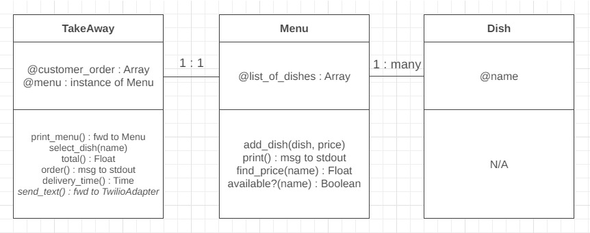

Takeaway Challenge
==================
```
                            _________
              r==           |       |
           _  //            |  M.A. |   ))))
          |_)//(''''':      |       |
            //  \_____:_____.-------D     )))))
           //   | ===  |   /        \
       .:'//.   \ \=|   \ /  .:'':./    )))))
      :' // ':   \ \ ''..'--:'-.. ':
      '. '' .'    \:.....:--'.-'' .'
       ':..:'                ':..:'

 ```

Instructions
-------

* Feel free to use google, your notes, books, etc. but work on your own
* If you refer to the solution of another coach or student, please put a link to that in your README
* If you have a partial solution, **still check in a partial solution**
* You must submit a pull request to this repo with your code by 9am Monday morning

Task
-----

* Fork this repo
* Run the command 'bundle' in the project directory to ensure you have all the gems
* Write a Takeaway program with the following user stories:

```
As a customer
So that I can check if I want to order something
I would like to see a list of dishes with prices

As a customer
So that I can order the meal I want
I would like to be able to select some number of several available dishes

As a customer
So that I can verify that my order is correct
I would like to check that the total I have been given matches the sum of the various dishes in my order

As a customer
So that I am reassured that my order will be delivered on time
I would like to receive a text such as "Thank you! Your order was placed and will be delivered before 18:52" after I have ordered
```

* Hints on functionality to implement:
  * Ensure you have a list of dishes with prices
  * The text should state that the order was placed successfully and that it will be delivered 1 hour from now, e.g. "Thank you! Your order was placed and will be delivered before 18:52".
  * The text sending functionality should be implemented using Twilio API. You'll need to register for it. It’s free.
  * Use the twilio-ruby gem to access the API
  * Use the Gemfile to manage your gems
  * Make sure that your Takeaway is thoroughly tested and that you use mocks and/or stubs, as necessary to not to send texts when your tests are run
  * However, if your Takeaway is loaded into IRB and the order is placed, the text should actually be sent
  * Note that you can only send texts in the same country as you have your account. I.e. if you have a UK account you can only send to UK numbers.

* Advanced! (have a go if you're feeling adventurous):
  * Implement the ability to place orders via text message.

* A free account on Twilio will only allow you to send texts to "verified" numbers. Use your mobile phone number, don't worry about the customer's mobile phone.

> :warning: **WARNING:** think twice before you push your **mobile number** or **Twilio API Key** to a public space like GitHub :eyes:
>
> :key: Now is a great time to think about security and how you can keep your private information secret. You might want to explore environment variables.

* Finally submit a pull request before Monday at 9am with your solution or partial solution.  However much or little amount of code you wrote please please please submit a pull request before Monday at 9am


In code review we'll be hoping to see:

* All tests passing
* High [Test coverage](https://github.com/makersacademy/course/blob/master/pills/test_coverage.md) (>95% is good)
* The code is elegant: every class has a clear responsibility, methods are short etc.

Reviewers will potentially be using this [code review rubric](docs/review.md).  Referring to this rubric in advance will make the challenge somewhat easier.  You should be the judge of how much challenge you want this at this moment.

Notes on Test Coverage
------------------

You can see your [test coverage](https://github.com/makersacademy/course/blob/master/pills/test_coverage.md) when you run your tests.

```
                            _________
              r==           |       |
           _  //            |  M.A. |   ))))
          |_)//(''''':      |       |
            //  \_____:_____.-------D     )))))
           //   | ===  |   /        \
       .:'//.   \ \=|   \ /  .:'':./    )))))
      :' // ':   \ \ ''..'--:'-.. ':
      '. '' .'    \:.....:--'.-'' .'
       ':..:'                ':..:'

 ```

My Solution
-----
A Makers Week 2 solo weekend challenge. 

* **Languages used**: Ruby
* **Testing frameworks**: RSpec

## Personal goals of this project
* practise Domain Modelling
* maintain isolation when unit testing using dependency injections, and doubles/mocking.
* high cohesion, low coupling
* testing the right thing (i.e. behaviour not state)
* consider edge cases
* practise more TDD using RED-GREEN-REFACTOR
* remember to refactor and use SRP!

## Functional Representation of User Stories

**Nouns**
| Nouns | Property or Owner of property? |
| ----- | ------------------------------ |
| TakeAway | Owner |
| Dish | Owner |
| name | Property owned by Dish |
| price | Property owned by Menu inside list_of_dishes |
| Menu | Owner |
| list_of_dishes | Property owned by Menu, contains dishes |
| customer_order | Property owned by TakeAway |

**Verbs**
| Actions | Action owned by? | Property it reads or changes | Property owned by? |
| ------- | ---------------- | ---------------------------- | ------------------ |
| print_menu | TakeAway | menu.print (reads) | Menu |
| select_dishes | TakeAway | customer_order (changes) | TakeAway |
| total | TakeAway | customer_order (reads) | TakeAway |
| send_text (perhaps private) | TakeAway | N/A | N/A |
| order | TakeAway | customer_order(reads & changes) | TakeAway |
| print | Menu | list_of_dishes (reads) | Menu |
| add_dish | Menu | list_of_dishes (changes) | Menu |
| find_price | Menu | list_of_dishes (reads) | Menu |
| available? | Menu | list_of_dishes (reads) | Menu |


## Domain Model

| Class | TakeAway |
| --- | --- |
| **Properties (instance variables):** | @customer_order : Array (of dish names) |
| | @menu : an instance of Menu |
| **Actions (methods):** | print_menu() : forwarded to Menu class|
| | select_dish(name) | 
| | total() : Float | 
| | order() : msg to stdout | 
| | delivery_time() : Time |
| | send_text() : perhaps private| 
_depends on Menu_ <br>

| Class | Menu |
| --- | --- |
| **Properties (instance variables):** | @list_of_dishes : Array of Hashes (name and price of a dish) |
| **Actions (methods):** | add_dish(dish, price) |
| | print() : msg to stdout | 
| | find_price(name) : Float | 
| | available?(name) : Boolean | 
_depends on Dish_ <br>

| Class | Dish |
| --- | --- |
| **Properties (instance variables):** | @name|
| **Actions (methods):** | N/A |
_has no dependencies_ <br>



## Usage
```
gem install bundler
```
```
bundle install
```

### .env variables
Create a .env file at the root of the project folder, then include the following with replaced with your personal details (please use +44 format in UK):
```
TWILIO_ACCOUNT_SID=your_twilio_account_sid_here
TWILIO_AUTH_TOKEN=your_twilio_auth_token_here
MOBILE_NUMBER=your_number_here
TWILIO_NUMBER=your_twilio_number_here
```

### To run feature tests in `irb`
To set up the take away with 3 sample items on the menu:
```irb
require './lib/menu.rb'
require './lib/takeaway.rb'
dish_1 = Dish.new( "McNuggets" )
dish_2 = Dish.new( "Big Mac" )
dish_3 = Dish.new( "Chicken Legend" )
menu = Menu.new
menu.add_dish(dish_1, 3.19)
menu.add_dish(dish_2, 3.19)
menu.add_dish(dish_3, 3.89)
takeaway = TakeAway.new(menu)
```

To interact with the takeaway: 
* See a list of dishes on the menu (`takeaway.print_menu`)
* Select dishes on the menu (`takeaway.select_dish("McNuggets")`) or use any other name as listed in the menu
* Check order (`takeaway.customer_order`) gives the list of dish names
* Check total (`takeaway.total`) gives the total cost of the dishes
* Place order (`takeaway.order`) confirms the amount, clears the customer_order list, and sends a text to you. 

## My Approach
**Domain Modelling using Class Diagrams**
* Intensely investigated user stories and used _Domain Modelling_ to create class diagrams (please see diagrams above).
* I wanted to determine what classes may be needed in order for the domain to be as cohesive as possible with minimal coupling. I decided to create 3 classes: `TakeAway`, `Menu`, and `Dish`.

**Test drive `Dish` class**
* The `Dish` class has no dependencies on other classes. It was easy to implement this with just a name.

**Test drive `Menu` class**
* The `Menu` class is expected to have an instance variable containing an Array which includes the dishes in some way.
* Since the `Menu` class has dependencies on the `Dish` class, I need to create Dish doubles in order to unit test `Menu` in isolation.
* Since we do not know how many dishes might be added to a menu, I TDD'd a new method to add dishes to a menu `add_dish`, using dependency injection. 
* I imagine the `list_of_dishes` instance variable would be an array containing hashes representing the dishes and their prices. 
* The prices would be determined when you add the dish to the menu.
* The menu class could easily be extended to `remove_dishes` as well, if required. Or if you wanted to `update_price` to match the rate of inflation! 
* During the test driving provess, I realised perhaps some `TakeAway` methods should belong in `Menu`, it was easy to move these. One example of this is the `print_menu` method which was forwarded to `Menu` class and I amended my class diagrams accordingly.  

**Test drive `TakeAway` class**
* I imagined how we would run the takeaway in IRB in a feature test. 
* The `TakeAway` class is initialized with a `menu` (instance of `Menu`). 
* In the unit tests I isolated the `Menu` class using dependency injection. 
* As I implemented the user story requirements, I forwarded methods to other classes and test drove those methods first.
* Edge cases considered:
  * trying to order a dish that's not on the menu
  * customer_order list is cleared after placing an order
  * trying to get the total when no dishes selected
  * trying to make an order when no dishes selected

**Twilio text confirmation**
* I used the twilio-ruby gem to handle SMS messaging. 
* I implemented a `TwilioAdapter` class that is responsible for sending the SMS. It instantiates the Twilio client when `send_sms` is called.
* When a takeaway is asked to make an order, it creates a new instance of `TwilioAdapter` and tells it to `send_sms` with the message "Thank you! Your order was placed and will be delivered before #{delivery_time}" (thus forwarding the responsibility to TwilioAdapter). 
* I am not sure how to unit test this functionality, but it seems to work in feature test.
* In order to prevent real SMS messages from being sent during the RSpec tests, I added a stub to the `spec_helper` to replace `Twilio::REST::Client` with a mocked version of it called `FakeSMS`.

**Final checks**
* Feature tested
* Checked that RSpec unit tests work on each class in isolation
* Linted with rubocop, 2 offences for unannotated tokens ignored. 

## Files
| File    | Description |
| ----------- | ----------- |
| README.md  | this readme page :) |
| dish.rb | code for Dish class |
| menu.rb | code for Menu class |
| takeaway.rb | code for TakeAway class |
| twilioadapter.rb | code for TwilioAdapter class |
| ./spec/dish_spec.rb | Unit tests for Dish class |
| ./spec/menu_spec.rb | Unit tests for Menu class |
| ./spec/takeaway_spec.rb | Unit tests for TakeAway class |
| ./spec/support/fakesms.rb | Mocked Twilio client |
| ./spec/spec_helper.rb | Added stub for Twilio client |
| .gitignore | added .env to protect secret keys |
| Gemfile | list of Gems required |
| classdiagram.jpeg | Class diagram image for README |
| **all other files** | **as forked from original repo** |

## TODO

* What if someone tries to add a non-dish to an instance of `Menu`? How would we TDD this in RSpec given that instance_doubles (a verifying double) of `Dish` does not return true when asking it if it `is_a? Dish`
* Test coverage on `TakeAway` `print_menu` method is not 100%, is it necessary to ensure test coverage as the responsibility should depend on `Menu` class? Not sure what matchers we can use here. 
* Should the `delivery_time` method be public or private? - I kept as public so that it could also be tested for the correct time, but think it should be a private method.
* How to test the `TwilioAdapter` class (Twilio API)? Is it necessary? How to test that the program sends out a message in text format in RSpec? Is it necessary to unit test `send_text` private method in `TakeAway` class? How can we be confident that we are meeting the needs of the user story?
* Investigate why unannotated tokens are unpreferable, for example:
```
def dish_price(item)
    '%.2f' % item[:price]
  end
```
* In future, commit more often (after each unit test pass/refactor) and better naming. 
* Investigate whether TwilioAdapter should be in class diagram.
* Refactor RSpec tests using DRY principle.

* Update description on files in the repo

