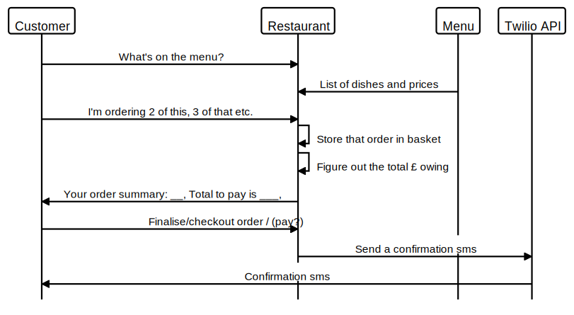

BecaLParker's solution to Takeaway Challenge
============================================

What does the code do?
-----------
Emulates a system for ordering takeaway from a restaurant.


Domain model
-----------


Setup
-----
* Clone this repo to your local machine
* Run the command 'bundle' in the project directory to ensure you have all the gems
* `irb -r './lib/restaurant.rb'`
* `2.6.5 :001 > kfc = Restaurant.new`
 `=> #<Restaurant:0x00007fe984874888> `


User stories and example irb interactions
-----------------------------------------

```
As a customer
So that I can check if I want to order something
I would like to see a list of dishes with prices

As a customer
So that I can order the meal I want
I would like to be able to select some number of several available dishes

As a customer
So that I can verify that my order is correct
I would like to check that the total I have been given matches the sum of the various dishes in my order

As a customer
So that I am reassured that my order will be delivered on time
I would like to receive a text such as "Thank you! Your order was placed and will be delivered before 18:52" after I have ordered
```


