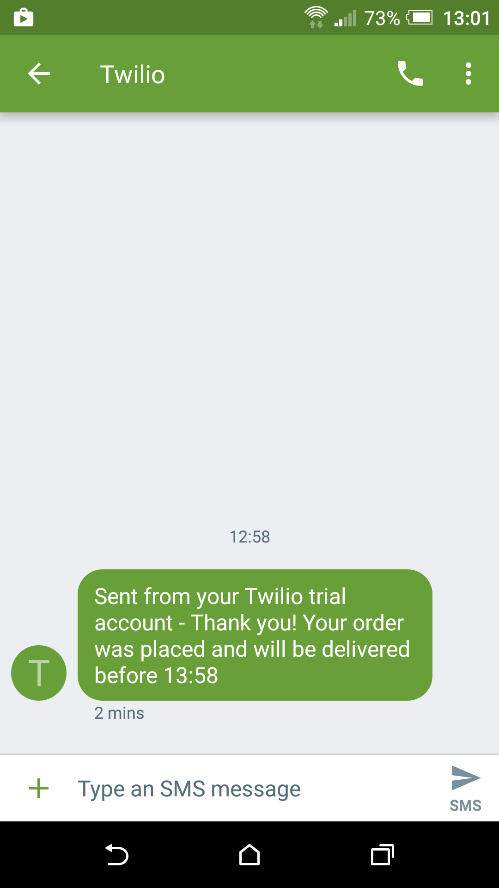

# Takeaway Challenge

```
                            _________
              r==           |       |
           _  //            |  M.A. |   ))))
          |_)//(''''':      |       |
            //  \_____:_____.-------D     )))))
           //   | ===  |   /        \
       .:'//.   \ \=|   \ /  .:'':./    )))))
      :' // ':   \ \ ''..'--:'-.. ':
      '. '' .'    \:.....:--'.-'' .'
       ':..:'                ':..:'

 ```
I have been asked to create an application which enables a user to view a menu, place a takeaway order, check that their order is correct, and receive confirmation that their order has been processed.  

## User Stories

```
As a customer
So that I can check if I want to order something
I would like to see a list of dishes with prices

As a customer
So that I can order the meal I want
I would like to be able to select some number of several available dishes

As a customer
So that I can verify that my order is correct
I would like to check that the total I have been given matches the sum of the various dishes in my order

As a customer
So that I am reassured that my order will be delivered on time
I would like to receive a text such as "Thank you! Your order was placed and will be delivered before 18:52" after I have ordered
```


## Installation

* Fork/clone this repo
* Run the command 'bundle' in the project directory to ensure you have all the gems


## Technology

In order to produce this application I used Ruby 2.3.1.  I used Rspec as a testing suite and used Twilio's Ruby gem to send confirmation SMS messages.

## Using the App

Below are two screenshots showing an example use of the application.  In the first screenshot, the user first creates an instance of TakeAway, before importing a sample menu using the method #import_menu.  This method was added to assist with testing and provides a default Italian restaurant menu into the application.  The user is able to call the method, passing an alternative file, for other types of menu. I have also included the method #add_to_menu in the event that the restaurant wishes to add individual items to their menu.


The user is able to see view their order at any time by calling #view_basket which displays a list of the current items in their order.  Alternatively, the user may call #view_total to see the current running total of their order.  The user may call #print_summary which displays a list of each of the items within their order as the current total price.

If the user is content with their order, they can then call #confirm_order which will send that user a text message containing an estimated delivery time.  A screenshot of the message received in the example case is produced below.




## Future Enhancements

Run the command '$ rspec' in order to see the current tests for this application.

## Future Enhancements

In the future, I would like to add a front end aspect to the application so as to better improve the user experience.  Furthermore, the confirmation SMS messages are currently hardcoded to send messages to one number and it would be a significant improvement if the user could enter their own contact number or, as an alternative, request confirmation of their order by email.
