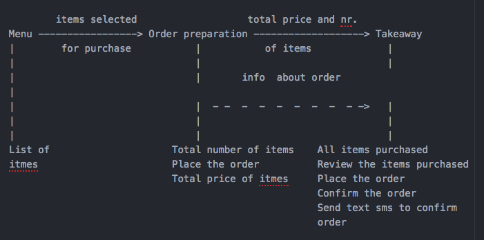

# Planning Document

## User Stories

### Story

```
As a customer
So that I can check if I want to order something
I would like to see a list of dishes with prices
```

### Domain Model

| Nouns          | Verbs  |
| -------------- | ------ |
| list of dishes | to see |
| prices         |        |

### Story

```
As a customer
So that I can order the meal I want
I would like to be able to select some number of several available dishes
```

### Domain Model

| Nouns              | Verbs     |
| ------------------ | --------- |
| (available) dishes | to select |

### Story

```
As a customer
So that I can verify that my order is correct
I would like to check that the total I have been given matches the sum of the various dishes in my order
```

### Domain Model

| Nouns                    | Verbs    |
| ------------------------ | -------- |
| total                    | to check |
| sum                      | to match |
| dishes (in user's order) |          |

### Story

```
As a customer
So that I am reassured that my order will be delivered on time
I would like to receive a text such as "Thank you! Your order was placed and will be delivered before 18:52" after I have ordered
```

### Domain Model

| Nouns        | Verbs      |
| ------------ | ---------- |
| text message | to receive |

### Class Diagrams

| Class      | menu                                   |
| ---------- | -------------------------------------- |
| Attributes | list, dish                             |
| Methods    | print_menu, check_available, load_menu |

| Class      | dish                   |
| ---------- | ---------------------- |
| Attributes | name, price, available |

| Class      | text_messenger         |
| ---------- | ---------------------- |
| Attributes | account_id, auth_token |
| Methods    | send                   |

| Class      | calculator |
| ---------- | ---------- |
| Attributes |            |
| Methods    | total      |

| Class      | restaurant                            |
| ---------- | ------------------------------------- |
| Attributes | dishes, text, menu                    |
| Methods    | place_order, add_to_order, view_order |

### Sequence Diagram

```
alias user="Customer"
alias menu="Menu"
alias dish="Dish "
alias text="Text Messenger"
alias calc="Calculator"
alias rest="Restaurant"


user->menu:"view menu"
user->menu:"filter menu by availability"
menu-->user:"display available dishes"
user->rest:"create new order"
user->rest:"add dish/dishes to order"
rest->menu:"check availability of ordered dishes"
menu-->rest:"confirms availability, return dish info"
rest->calculator:"list of ordered dishes"
calculator-->rest:"calculates total price"
rest-->user:"displays ordered dishes and total price"
user->rest:"confirm order"
rest->text:"request text to confirm order"
text-->user:"confirmation text"
```


